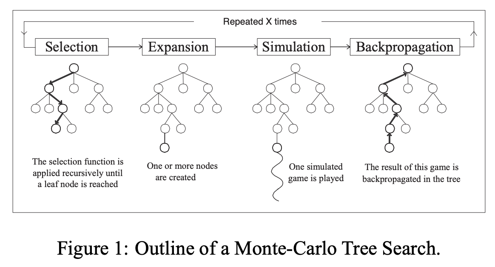

# [Monte-Carlo Tree Search](https://paperswithcode.com/method/monte-carlo-tree-search)

**Monte-Carlo Tree Search** is a planning algorithm that accumulates value estimates obtained from Monte Carlo simulations in order to successively direct simulations towards more highly-rewarded trajectories. We execute MCTS after encountering each new state to select an agent's action for that state: it is executed again to select the action for the next state. Each execution is an iterative process that simulates many trajectories starting from the current state to the terminal state. The core idea is to successively focus multiple simulations starting at the current state by extending the initial portions of trajectories that have received high evaluations from earlier simulations.

Source: Sutton and Barto, Reinforcement Learning (2nd Edition)

Image Credit: [Chaslot et al](https://www.aaai.org/Papers/AIIDE/2008/AIIDE08-036.pdf)

# [HFPSO](https://paperswithcode.com/method/hfpso)

A hybrid metaheuristic optimization algorithm that combines strong points of FA and PSO

