# [Q-Learning](https://paperswithcode.com/method/q-learning)
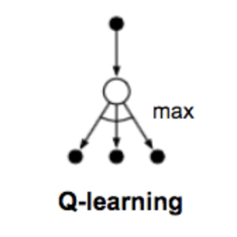

**Q-Learning** is an off-policy temporal difference control algorithm:

$$Q\left(S_{t}, A_{t}\right) \leftarrow Q\left(S_{t}, A_{t}\right) + \alpha\left[R_{t+1} + \gamma\max_{a}Q\left(S_{t+1}, a\right) - Q\left(S_{t}, A_{t}\right)\right] $$

The learned action-value function $Q$ directly approximates $q_{*}$, the optimal action-value function, independent of the policy being followed.

Source: Sutton and Barto, Reinforcement Learning, 2nd Edition

# [DQN](https://paperswithcode.com/method/dqn)
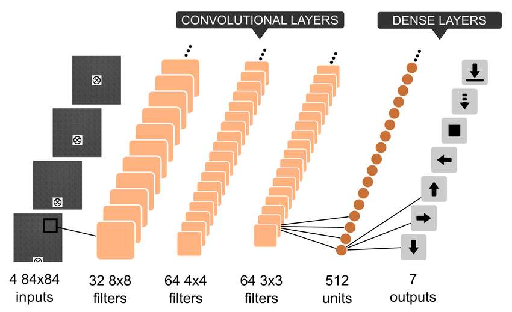

A **DQN**, or Deep Q-Network, approximates a state-value function in a [Q-Learning](https://paperswithcode.com/method/q-learning) framework with a neural network. In the Atari Games case, they take in several frames of the game as an input and output state values for each action as an output. 

It is usually used in conjunction with Experience Replay, for storing the episode steps in memory for off-policy learning, where samples are drawn from the replay memory at random. Additionally, the Q-Network is usually optimized towards a frozen target network that is periodically updated with the latest weights every $k$ steps (where $k$ is a hyperparameter). The latter makes training more stable by preventing short-term oscillations from a moving target. The former tackles autocorrelation that would occur from on-line learning, and having a replay memory makes the problem more like a supervised learning problem.

Image Source: [here](https://www.researchgate.net/publication/319643003_Autonomous_Quadrotor_Landing_using_Deep_Reinforcement_Learning)

source: [source](http://arxiv.org/abs/1312.5602v1)
# [Double Q-learning](https://paperswithcode.com/method/double-q-learning)
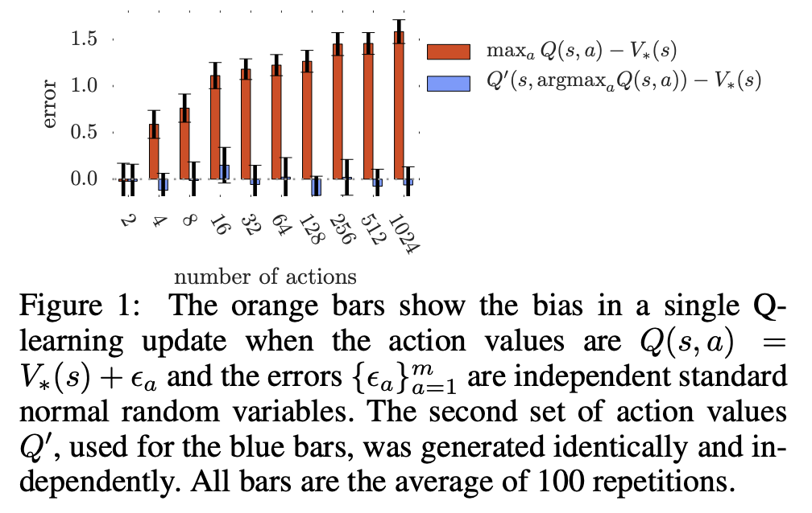

**Double Q-learning** is an off-policy reinforcement learning algorithm that utilises double estimation to counteract overestimation problems with traditional Q-learning. 

The max operator in standard [Q-learning](https://paperswithcode.com/method/q-learning) and [DQN](https://paperswithcode.com/method/dqn) uses the same values both to select and to evaluate an action. This makes it more likely to select overestimated values, resulting in overoptimistic value estimates. To prevent this, we can decouple the selection from the evaluation, which is the idea behind Double Q-learning:

$$ Y^{Q}_{t} = R_{t+1} + \gamma{Q}\left(S_{t+1}, \arg\max_{a}Q\left(S_{t+1}, a; \mathbb{\theta}_{t}\right)\mathbb{\theta}_{t}\right) $$

The Double Q-learning error can then be written as:

$$ Y^{DoubleQ}_{t} = R_{t+1} + \gamma{Q}\left(S_{t+1}, \arg\max_{a}Q\left(S_{t+1}, a; \mathbb{\theta}_{t}\right)\mathbb{\theta}^{'}_{t}\right) $$

Here the selection of the action in the $\arg\max$ is still due to the online weights $\theta_{t}$. But we use a second set of weights $\mathbb{\theta}^{'}_{t}$ to fairly evaluate the value of this policy.

Source: [Deep Reinforcement Learning with Double Q-learning](https://beta.paperswithcode.com/paper/deep-reinforcement-learning-with-double-q)

source: [source](http://papers.nips.cc/paper/3964-double-q-learning)
# [Clipped Double Q-learning](https://paperswithcode.com/method/clipped-double-q-learning)
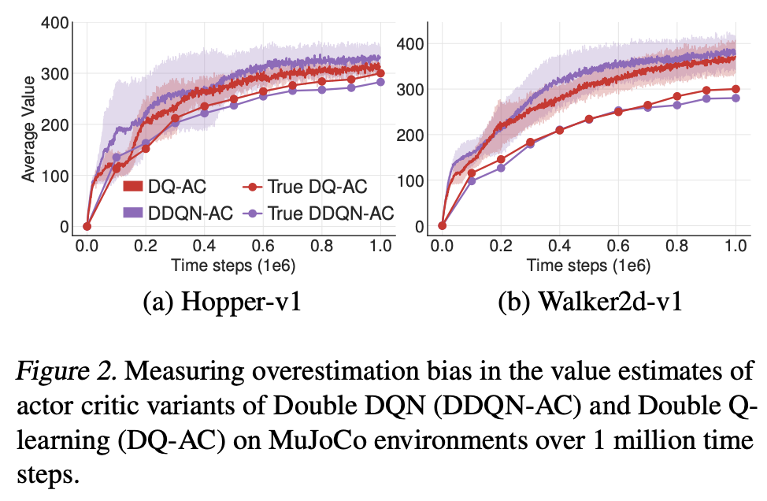

**Clipped Double Q-learning** is a variant on [Double Q-learning](https://paperswithcode.com/method/double-q-learning) that upper-bounds the less biased Q estimate $Q_{\theta_{2}}$ by the biased estimate $Q_{\theta_{1}}$. This is equivalent to taking the minimum of the two estimates, resulting in the following target update:

$$ y_{1} = r + \gamma\min_{i=1,2}Q_{\theta'_{i}}\left(s', \pi_{\phi_{1}}\left(s'\right)\right) $$

The motivation for this extension is that vanilla double Q-learning is sometimes ineffective if the target and current networks are too similar, e.g. with a slow-changing policy in an actor-critic framework.

source: [source](http://arxiv.org/abs/1802.09477v3)
# [Dueling Network](https://paperswithcode.com/method/dueling-network)
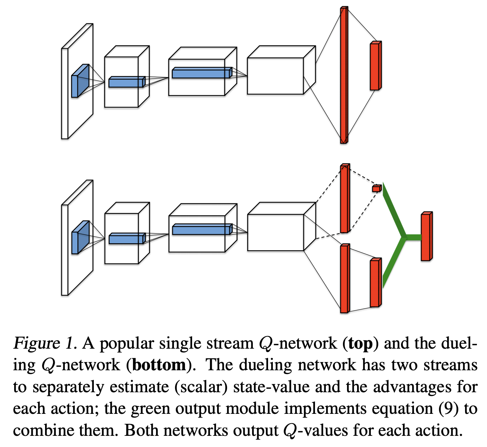

A **Dueling Network** is a type of Q-Network that has two streams to separately estimate (scalar) state-value and the advantages for each action. Both streams share a common convolutional feature learning module. The two streams are combined via a special aggregating layer to produce an
estimate of the state-action value function Q as shown in the figure to the right.

The last module uses the following mapping:

$$ Q\left(s, a, \theta, \alpha, \beta\right) =V\left(s, \theta, \beta\right) + \left(A\left(s, a, \theta, \alpha\right) - \frac{1}{|\mathcal{A}|}\sum_{a'}A\left(s, a'; \theta, \alpha\right)\right) $$

This formulation is chosen for identifiability so that the advantage function has zero advantage for the chosen action, but instead of a maximum we use an average operator to increase the stability of the optimization.

source: [source](http://arxiv.org/abs/1511.06581v3)
# [Double DQN](https://paperswithcode.com/method/double-dqn)
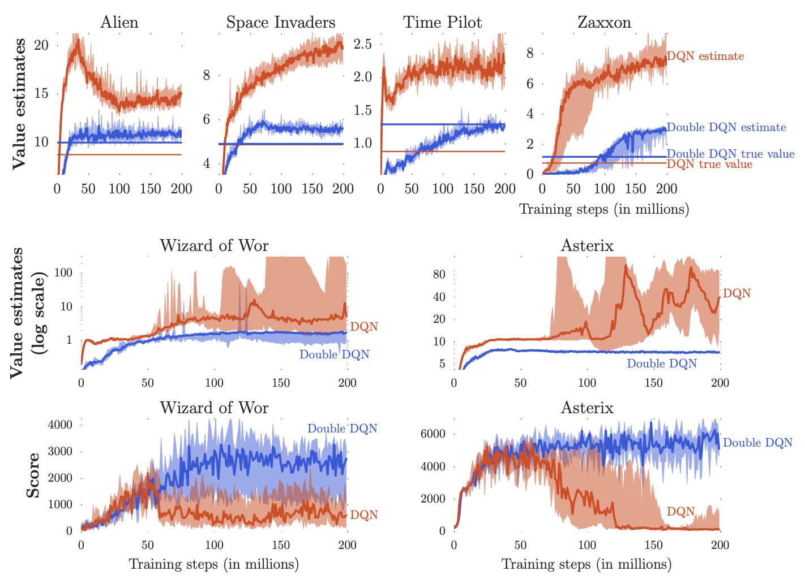

A **Double Deep Q-Network**, or **Double DQN** utilises Double Q-learning to reduce overestimation by decomposing the max operation in the target into action selection and action evaluation. We evaluate the greedy policy according to the online network, but we use the target network to estimate its value.  The update is the same as for DQN, but replacing the target $Y^{DQN}_{t}$ with:

$$ Y^{DoubleDQN}_{t} = R_{t+1}+\gamma{Q}\left(S_{t+1}, \arg\max_{a}Q\left(S_{t+1}, a; \theta_{t}\right);\theta_{t}^{-}\right) $$

Compared to the original formulation of Double Q-Learning, in Double DQN the weights of the second network $\theta^{'}_{t}$ are replaced with the weights of the target network $\theta_{t}^{-}$ for the evaluation of the current greedy policy.

source: [source](http://arxiv.org/abs/1509.06461v3)
# [Rainbow DQN](https://paperswithcode.com/method/rainbow-dqn)
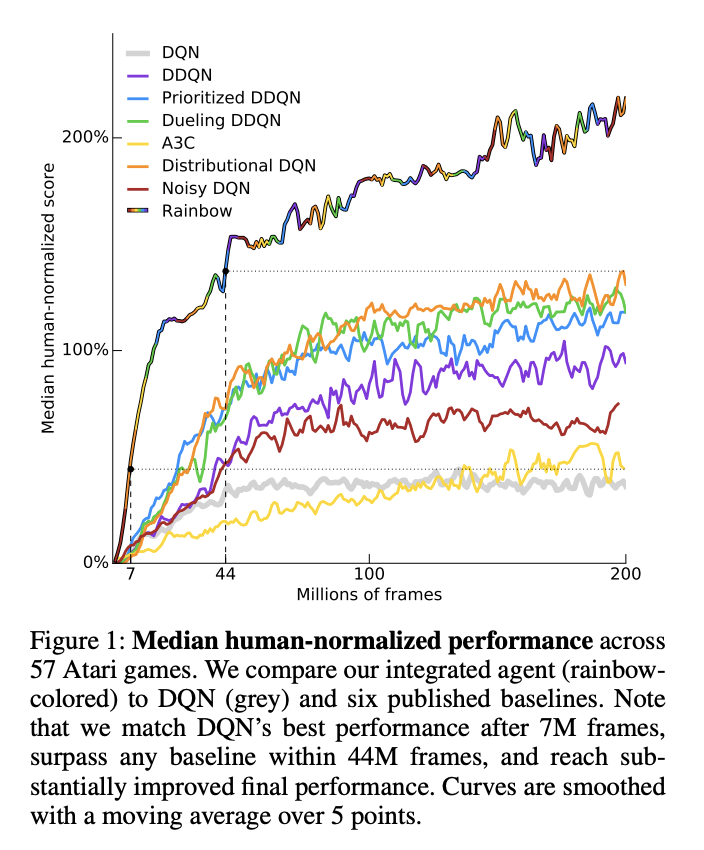

**Rainbow DQN** is an extended [DQN](https://paperswithcode.com/method/dqn) that combines several improvements into a single learner. Specifically:

- It uses Double Q-Learning to tackle overestimation bias.
- It uses Prioritized Experience Replay to prioritize important transitions.
- It uses dueling networks.
- It uses multi-step learning .
- It uses distributional reinforcement learning instead of the expected return.
- It uses noisy linear layers for exploration.

source: [source](http://arxiv.org/abs/1710.02298v1)
# [Expected Sarsa](https://paperswithcode.com/method/expected-sarsa)

**Expected Sarsa** is like [Q-learning](https://paperswithcode.com/method/q-learning) but instead of taking the maximum over next state-action pairs, we use the expected value, taking into account how likely each action is under the current policy.

$$Q\left(S_{t}, A_{t}\right) \leftarrow Q\left(S_{t}, A_{t}\right) + \alpha\left[R_{t+1} + \gamma\sum_{a}\pi\left(a\mid{S_{t+1}}\right)Q\left(S_{t+1}, a\right) - Q\left(S_{t}, A_{t}\right)\right] $$

Except for this change to the update rule, the algorithm otherwise follows the scheme of Q-learning. It is more computationally expensive than [Sarsa](https://paperswithcode.com/method/sarsa) but it eliminates the variance due to the random selection of $A_{t+1}$.

Source: Sutton and Barto, Reinforcement Learning, 2nd Edition

# [Ape-X DQN](https://paperswithcode.com/method/ape-x-dqn)
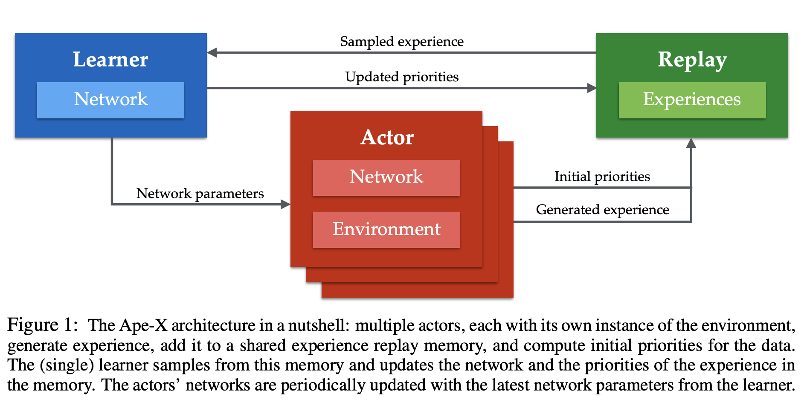

**Ape-X DQN** is a variant of a [DQN](https://paperswithcode.com/method/dqn) with some components of [Rainbow-DQN](https://paperswithcode.com/method/rainbow-dqn) that utilizes distributed prioritized experience replay through the [Ape-X](https://paperswithcode.com/method/ape-x) architecture.

source: [source](http://arxiv.org/abs/1803.00933v1)
# [REM](https://paperswithcode.com/method/rem)
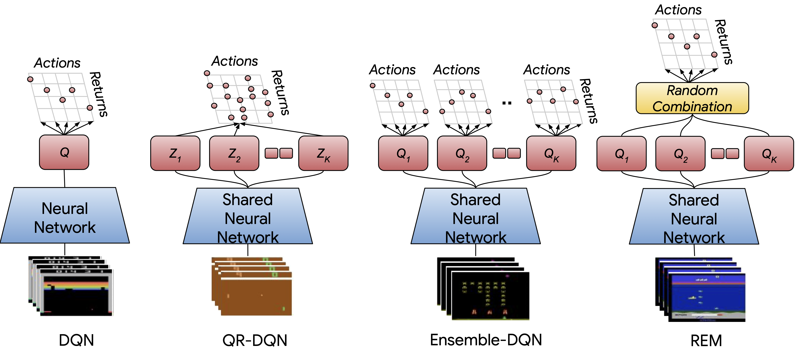

Random Ensemble Mixture (REM) is an easy to implement extension of DQN inspired by Dropout. The key intuition behind REM is that if one has access to multiple estimates of Q-values, then a weighted combination of the Q-value estimates is also an estimate for Q-values. Accordingly, in each training step, REM randomly combines multiple Q-value estimates and uses this random combination for robust training.

source: [source](https://arxiv.org/abs/1907.04543v4)
# [NoisyNet-DQN](https://paperswithcode.com/method/noisynet-dqn)
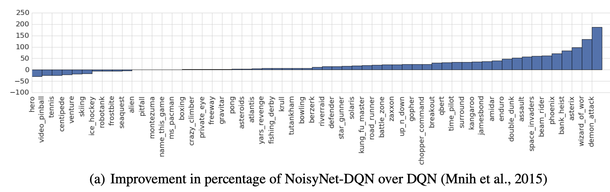

**NoisyNet-DQN** is a modification of a [DQN](https://paperswithcode.com/method/dqn) that utilises noisy linear layers for exploration instead of $\epsilon$-greedy exploration as in the original DQN formulation.

source: [source](https://arxiv.org/abs/1706.10295v3)
# [NoisyNet-Dueling](https://paperswithcode.com/method/noisynet-dueling)
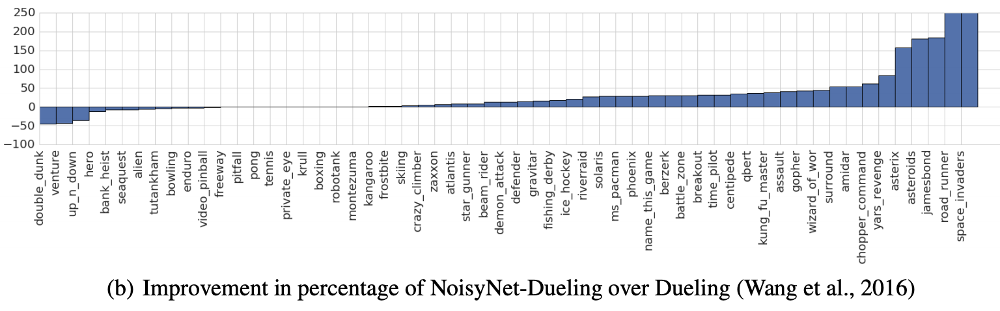

**NoisyNet-Dueling** is a modification of a [Dueling Network](https://paperswithcode.com/method/dueling-network) that utilises noisy linear layers for exploration instead of $\epsilon$-greedy exploration as in the original Dueling formulation.

source: [source](https://arxiv.org/abs/1706.10295v3)
