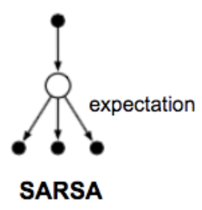
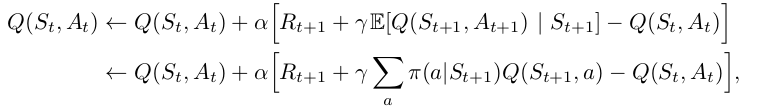
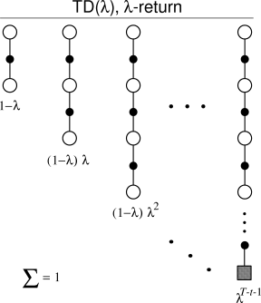
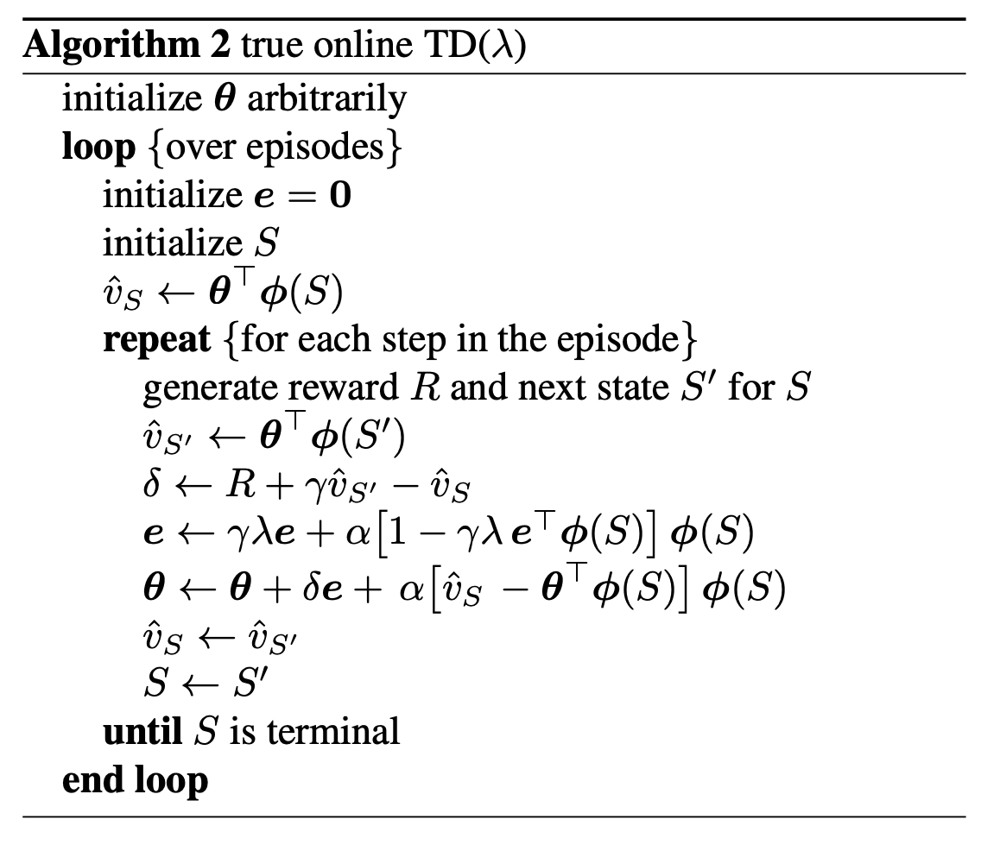
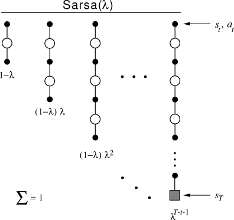

# [Sarsa](https://paperswithcode.com/method/sarsa)

**Sarsa** is an on-policy TD control algorithm:

$$Q\left(S_{t}, A_{t}\right) \leftarrow Q\left(S_{t}, A_{t}\right) + \alpha\left[R_{t+1} + \gamma{Q}\left(S_{t+1}, A_{t+1}\right) - Q\left(S_{t}, A_{t}\right)\right] $$

This update is done after every transition from a nonterminal state $S_{t}$. if $S_{t+1}$ is terminal, then $Q\left(S_{t+1}, A_{t+1}\right)$ is defined as zero.

To design an on-policy control algorithm using Sarsa, we estimate $q_{\pi}$ for a behaviour policy $\pi$ and then change $\pi$ towards greediness with respect to $q_{\pi}$.

Source: Sutton and Barto, Reinforcement Learning, 2nd Edition

# [Expected Sarsa](https://paperswithcode.com/method/expected-sarsa)

**Expected Sarsa** is like [Q-learning](https://paperswithcode.com/method/q-learning) but instead of taking the maximum over next state-action pairs, we use the expected value, taking into account how likely each action is under the current policy.

$$Q\left(S_{t}, A_{t}\right) \leftarrow Q\left(S_{t}, A_{t}\right) + \alpha\left[R_{t+1} + \gamma\sum_{a}\pi\left(a\mid{S_{t+1}}\right)Q\left(S_{t+1}, a\right) - Q\left(S_{t}, A_{t}\right)\right] $$

Except for this change to the update rule, the algorithm otherwise follows the scheme of Q-learning. It is more computationally expensive than [Sarsa](https://paperswithcode.com/method/sarsa) but it eliminates the variance due to the random selection of $A_{t+1}$.

Source: Sutton and Barto, Reinforcement Learning, 2nd Edition

# [TD Lambda](https://paperswithcode.com/method/td-lambda)

**TD$\left(\lambda\right)$** is a generalisation of **TD$\left(n\right)$** reinforcement learning algorithms, but it employs an eligibility trace $\lambda$ and $\lambda$-weighted returns. The eligibility trace vector is initialized to zero at the beginning of the episode, and it is incremented on each time step by the value gradient, and then fades away by $\gamma\lambda$:

$$ \textbf{z}_{-1} = \mathbf{0} $$
$$ \textbf{z}_{t} = \gamma\lambda\textbf{z}_{t-1} + \nabla\hat{v}\left(S_{t}, \mathbf{w}_{t}\right), 0 \leq t \leq T$$

The eligibility trace keeps track of which components of the weight vector contribute to recent state valuations. Here $\nabla\hat{v}\left(S_{t}, \mathbf{w}_{t}\right)$ is the feature vector.

The TD error for state-value prediction is:

$$ \delta_{t} = R_{t+1} + \gamma\hat{v}\left(S_{t+1}, \mathbf{w}_{t}\right) - \hat{v}\left(S_{t}, \mathbf{w}_{t}\right) $$

In **TD$\left(\lambda\right)$**, the weight vector is updated on each step proportional to the scalar TD error and the vector eligibility trace:

$$ \mathbf{w}_{t+1} = \mathbf{w}_{t} + \alpha\delta\mathbf{z}_{t}  $$

Source: Sutton and Barto, Reinforcement Learning, 2nd Edition

# [True Online TD Lambda](https://paperswithcode.com/method/true-online-td-lambda)

**True Online $TD\left(\lambda\right)$** seeks to approximate the ideal online $\lambda$-return algorithm. It seeks to invert this ideal forward-view algorithm to produce an efficient backward-view algorithm using eligibility traces. It uses dutch traces rather than accumulating traces.

Source: [Sutton and Seijen](http://proceedings.mlr.press/v32/seijen14.pdf)

# [Sarsa Lambda](https://paperswithcode.com/method/sarsa-lambda)

**Sarsa$\left(\lambda\right)$** extends eligibility-traces to action-value methods. It has the same update rule as for **TD$\left(\lambda\right)$** but we use the action-value form of the TD erorr:

$$ \delta_{t} = R_{t+1} + \gamma\hat{q}\left(S_{t+1}, A_{t+1}, \mathbb{w}_{t}\right) - \hat{q}\left(S_{t}, A_{t}, \mathbb{w}_{t}\right) $$

and the action-value form of the eligibility trace:

$$ \mathbb{z}_{-1} = \mathbb{0} $$

$$ \mathbb{z}_{t} = \gamma\lambda\mathbb{z}_{t-1} + \nabla\hat{q}\left(S_{t}, A_{t}, \mathbb{w}_{t} \right), 0 \leq t \leq T$$

Source: Sutton and Barto, Reinforcement Learning, 2nd Edition

