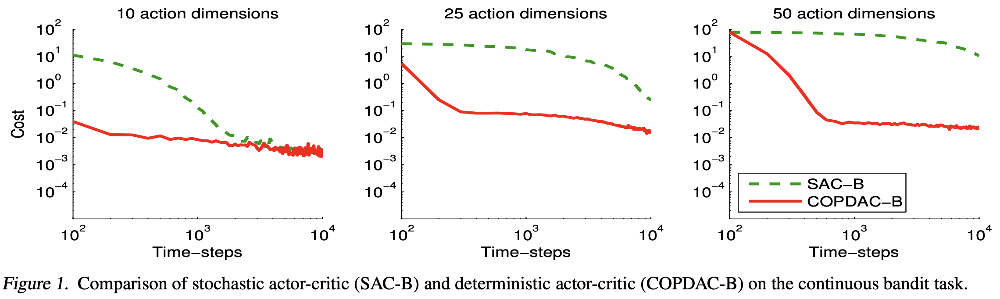
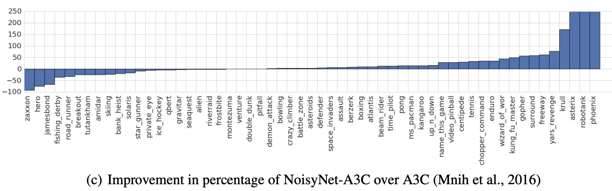
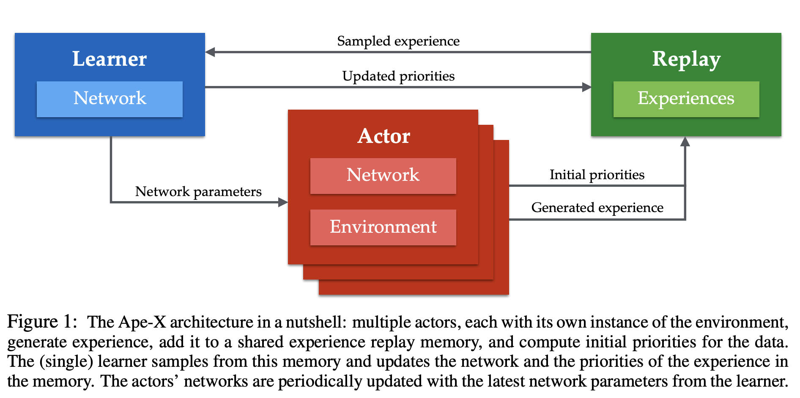

# [PPO](https://paperswithcode.com/method/ppo)

**Proximal Policy Optimization**, or **PPO**, is a policy gradient method for reinforcement learning. The motivation was to have an algorithm with the data efficiency and reliable performance of [TRPO](https://paperswithcode.com/method/trpo), while using only first-order optimization. 

Let $r_{t}\left(\theta\right)$ denote the probability ratio $r_{t}\left(\theta\right) = \frac{\pi_{\theta}\left(a_{t}\mid{s_{t}}\right)}{\pi_{\theta_{old}}\left(a_{t}\mid{s_{t}}\right)}$, so $r\left(\theta_{old}\right) = 1$. TRPO maximizes a “surrogate” objective:

$$ L^{\text{CPI}}\left({\theta}\right) = \hat{\mathbb{E}}_{t}\left[\frac{\pi_{\theta}\left(a_{t}\mid{s_{t}}\right)}{\pi_{\theta_{old}}\left(a_{t}\mid{s_{t}}\right)})\hat{A}_{t}\right] = \hat{\mathbb{E}}_{t}\left[r_{t}\left(\theta\right)\hat{A}_{t}\right] $$

Where $CPI$ refers to a conservative policy iteration. Without a constraint, maximization of $L^{CPI}$ would lead to an excessively large policy update; hence, we PPO modifies the objective, to penalize changes to the policy that move $r_{t}\left(\theta\right)$ away from 1:

$$ J^{\text{CLIP}}\left({\theta}\right) = \hat{\mathbb{E}}_{t}\left[\min\left(r_{t}\left(\theta\right)\hat{A}_{t}, \text{clip}\left(r_{t}\left(\theta\right), 1-\epsilon, 1+\epsilon\right)\hat{A}_{t}\right)\right] $$

where $\epsilon$ is a hyperparameter, say, $\epsilon = 0.2$. The motivation for this objective is as follows. The first term inside the min is $L^{CPI}$. The second term, $\text{clip}\left(r_{t}\left(\theta\right), 1-\epsilon, 1+\epsilon\right)\hat{A}_{t}$ modifies the surrogate
objective by clipping the probability ratio, which removes the incentive for moving $r_{t}$ outside of the interval $\left[1 − \epsilon, 1 + \epsilon\right]$. Finally, we take the minimum of the clipped and unclipped objective, so the final objective is a lower bound (i.e., a pessimistic bound) on the unclipped objective. With this scheme, we only ignore the change in probability ratio when it would make the objective improve, and we include it when it makes the objective worse. 

One detail to note is that when we apply PPO for a network where we have shared parameters for actor and critic functions, we typically add to the objective function an error term on value estimation and an entropy term to encourage exploration.

source: [source](http://arxiv.org/abs/1707.06347v2)
# [DDPG](https://paperswithcode.com/method/ddpg)

**DDPG**, or **Deep Deterministic Policy Gradient**, is an actor-critic, model-free algorithm based on the deterministic policy gradient that can operate over continuous action spaces. It combines the actor-critic approach with insights from [DQNs](https://paperswithcode.com/method/dqn): in particular, the insights that 1) the network is trained off-policy with samples from a replay buffer to minimize correlations between samples, and 2) the network is trained with a target Q network to give consistent targets during temporal difference backups. DDPG makes use of the same ideas along with batch normalization.

source: [source](https://arxiv.org/abs/1509.02971v6)
# [REINFORCE](https://paperswithcode.com/method/reinforce)

**REINFORCE** is a Monte Carlo variant of a policy gradient algorithm in reinforcement learning. The agent collects samples of an episode using its current policy, and uses it to update the policy parameter $\theta$. Since one full trajectory must be completed to construct a sample space, it is updated as an off-policy algorithm.

$$ \nabla_{\theta}J\left(\theta\right) = \mathbb{E}_{\pi}\left[G_{t}\nabla_{\theta}\ln\pi_{\theta}\left(A_{t}\mid{S_{t}}\right)\right]$$

Image Credit: [Tingwu Wang](http://www.cs.toronto.edu/~tingwuwang/REINFORCE.pdf)

# [A3C](https://paperswithcode.com/method/a3c)

**A3C**, **Asynchronous Advantage Actor Critic**, is a policy gradient algorithm in reinforcement learning that maintains a policy $\pi\left(a_{t}\mid{s}_{t}; \theta\right)$ and an estimate of the value
function $V\left(s_{t}; \theta_{v}\right)$. It operates in the forward view and uses a mix of $n$-step returns to update both the policy and the value-function. The policy and the value function are updated after every $t_{\text{max}}$ actions or when a terminal state is reached. The update performed by the algorithm can be seen as $\nabla_{\theta{'}}\log\pi\left(a_{t}\mid{s_{t}}; \theta{'}\right)A\left(s_{t}, a_{t}; \theta, \theta_{v}\right)$ where $A\left(s_{t}, a_{t}; \theta, \theta_{v}\right)$ is an estimate of the advantage function given by:

$$\sum^{k-1}_{i=0}\gamma^{i}r_{t+i} + \gamma^{k}V\left(s_{t+k}; \theta_{v}\right) - V\left(s_{t}; \theta_{v}\right)$$

where $k$ can vary from state to state and is upper-bounded by $t_{max}$.

The critics in A3C learn the value function while multiple actors are trained in parallel and get synced with global parameters every so often. The gradients are accumulated as part of training for stability - this is like parallelized stochastic gradient descent.

Note that while the parameters $\theta$ of the policy and $\theta_{v}$ of the value function are shown as being separate for generality, we always share some of the parameters in practice. We typically use a convolutional neural network that has one softmax output for the policy $\pi\left(a_{t}\mid{s}_{t}; \theta\right)$ and one linear output for the value function $V\left(s_{t}; \theta_{v}\right)$, with all non-output layers shared.

source: [source](http://arxiv.org/abs/1602.01783v2)
# [TRPO](https://paperswithcode.com/method/trpo)

**Trust Region Policy Optimization**, or **TRPO**, is a policy gradient method in reinforcement learning that avoids parameter updates that change the policy too much with a KL divergence constraint on the size of the policy update at each iteration.

Take the case of off-policy reinforcement learning, where the policy $\beta$ for collecting trajectories on rollout workers is different from the policy $\pi$ to optimize for. The objective function in an off-policy model measures the total advantage over the state visitation distribution and actions, while the mismatch between the training data distribution and the true policy state distribution is compensated with an importance sampling estimator:

$$ J\left(\theta\right) = \sum_{s\in{S}}p^{\pi_{\theta_{old}}}\sum_{a\in\mathcal{A}}\left(\pi_{\theta}\left(a\mid{s}\right)\hat{A}_{\theta_{old}}\left(s, a\right)\right) $$

$$ J\left(\theta\right) = \sum_{s\in{S}}p^{\pi_{\theta_{old}}}\sum_{a\in\mathcal{A}}\left(\beta\left(a\mid{s}\right)\frac{\pi_{\theta}\left(a\mid{s}\right)}{\beta\left(a\mid{s}\right)}\hat{A}_{\theta_{old}}\left(s, a\right)\right) $$

$$ J\left(\theta\right) = \mathbb{E}_{s\sim{p}^{\pi_{\theta_{old}}}, a\sim{\beta}} \left(\frac{\pi_{\theta}\left(a\mid{s}\right)}{\beta\left(a\mid{s}\right)}\hat{A}_{\theta_{old}}\left(s, a\right)\right)$$

When training on policy, theoretically the policy for collecting data is same as the policy that we want to optimize. However, when rollout workers and optimizers are running in parallel asynchronously, the behavior policy can get stale. TRPO considers this subtle difference: It labels the behavior policy as $\pi_{\theta_{old}}\left(a\mid{s}\right)$ and thus the objective function becomes:

$$ J\left(\theta\right) = \mathbb{E}_{s\sim{p}^{\pi_{\theta_{old}}}, a\sim{\pi_{\theta_{old}}}} \left(\frac{\pi_{\theta}\left(a\mid{s}\right)}{\pi_{\theta_{old}}\left(a\mid{s}\right)}\hat{A}_{\theta_{old}}\left(s, a\right)\right)$$

TRPO aims to maximize the objective function $J\left(\theta\right)$ subject to a trust region constraint which enforces the distance between old and new policies measured by KL-divergence to be small enough, within a parameter $\delta$:

$$ \mathbb{E}_{s\sim{p}^{\pi_{\theta_{old}}}} \left[D_{KL}\left(\pi_{\theta_{old}}\left(.\mid{s}\right)\mid\mid\pi_{\theta}\left(.\mid{s}\right)\right)\right] \leq \delta$$

source: [source](http://arxiv.org/abs/1502.05477v5)
# [A2C](https://paperswithcode.com/method/a2c)

**A2C**, or **Advantage Actor Critic**, is a synchronous version of the [A3C](https://paperswithcode.com/method/a3c) policy gradient method. As an alternative to the asynchronous implementation of A3C, A2C is a synchronous, deterministic implementation that waits for each actor to finish its segment of experience before updating, averaging over all of the actors. This more effectively uses GPUs due to larger batch sizes.

Image Credit: [OpenAI Baselines](https://openai.com/blog/baselines-acktr-a2c/)

source: [source](http://arxiv.org/abs/1602.01783v2)
# [Soft Actor Critic](https://paperswithcode.com/method/soft-actor-critic)

**Soft Actor Critic**, or **SAC**, is an off-policy actor-critic deep RL algorithm based on the maximum entropy reinforcement learning framework. In this framework, the actor aims to maximize expected reward while also maximizing entropy. That is, to succeed at the task while acting as randomly as possible. Prior deep RL methods based on this framework have been formulated as [Q-learning methods](https://paperswithcode.com/method/q-learning). SAC combines off-policy updates with a stable stochastic actor-critic formulation.

The SAC objective has a number of advantages. First, the policy is incentivized to explore more widely, while giving up on clearly unpromising avenues. Second, the policy can capture multiple modes of near-optimal behavior. In problem settings where multiple actions seem equally attractive, the policy will commit equal probability mass to those actions. Lastly, the authors present evidence that it improves learning speed over state-of-art methods that optimize the conventional RL objective function.

source: [source](http://arxiv.org/abs/1801.01290v2)
# [TD3](https://paperswithcode.com/method/td3)

**TD3** builds on the [DDPG](https://paperswithcode.com/method/ddpg) algorithm for reinforcement learning, with a couple of modifications aimed at tackling overestimation bias with the value function. In particular, it utilises clipped double Q-learning, delayed update of target and policy networks, and target policy smoothing (which is similar to a [SARSA](https://paperswithcode.com/method/sarsa) based update; a safer update, as they provide higher value to actions resistant to perturbations).

source: [source](http://arxiv.org/abs/1802.09477v3)
# [MADDPG](https://paperswithcode.com/method/maddpg)

**MADDPG**, or **Multi-agent DDPG**, extends [DDPG](https://paperswithcode.com/method/ddpg) into a multi-agent policy gradient algorithm where decentralized agents learn a centralized critic based on the observations and actions of all agents. It leads to learned policies that only use local information (i.e. their own observations) at execution time, does not assume a differentiable model of the environment dynamics or any particular structure on the communication method between agents, and is applicable not only to cooperative interaction but to competitive or mixed interaction involving both physical and communicative behavior. The critic is augmented with extra information about the policies of other agents, while the actor only has access to local information. After training is completed, only the local actors are used at execution phase, acting in a decentralized manner.

source: [source](https://arxiv.org/abs/1706.02275v4)
# [DPG](https://paperswithcode.com/method/dpg)

**Deterministic Policy Gradient**, or **DPG**, is a policy gradient method for reinforcement learning. Instead of the policy function $\pi\left(.\mid{s}\right)$ being modeled as a probability distribution, DPG considers and calculates gradients for a deterministic policy $a = \mu_{theta}\left(s\right)$.

# [IMPALA](https://paperswithcode.com/method/impala)

**IMPALA**, or the **Importance Weighted Actor Learner Architecture**, is an off-policy actor-critic framework that decouples acting from learning and learns from experience trajectories using V-trace. Unlike the popular [A3C](https://paperswithcode.com/method/a3c)-based agents, in which workers communicate gradients with respect to the parameters of the policy to a central parameter server, IMPALA actors communicate trajectories of experience (sequences of states, actions, and rewards) to a centralized learner. Since the learner in IMPALA has access to full trajectories of experience we use a GPU to perform updates on mini-batches of trajectories while aggressively parallelising all time independent operations. 

This type of decoupled architecture can achieve very high throughput. However, because the policy used to generate a trajectory can lag behind the policy on the learner by several updates at the time of gradient calculation, learning becomes off-policy. The V-trace off-policy actor-critic algorithm is used to correct for this harmful discrepancy.

source: [source](http://arxiv.org/abs/1802.01561v3)
# [D4PG](https://paperswithcode.com/method/d4pg)

**D4PG**, or **Distributed Distributional DDPG**, is a policy gradient algorithm that extends upon the [DDPG](https://paperswithcode.com/method/ddpg). The improvements include a distributional updates to the DDPG algorithm, combined with the use of multiple distributed workers all writing into the same replay table. The biggest performance gain of other simpler changes was the use of $N$-step returns. The authors found that the use of prioritized experience replay was less crucial to the overall D4PG algorithm especially on harder problems.

source: [source](http://arxiv.org/abs/1804.08617v1)
# [ACER](https://paperswithcode.com/method/acer)

**ACER**, or **Actor Critic with Experience Replay**, is an actor-critic deep reinforcement learning agent with experience replay. It can be seen as an off-policy extension of [A3C](https://paperswithcode.com/method/a3c), where the off-policy estimator is made feasible by:

- Using Retrace Q-value estimation.
- Using truncated importance sampling with bias correction.
- Using a trust region policy optimization method.
- Using a stochastic dueling network architecture.

source: [source](http://arxiv.org/abs/1611.01224v2)
# [Soft Actor-Critic (Autotuned Temperature)](https://paperswithcode.com/method/soft-actor-critic-autotuned-temperature)

**Soft Actor Critic (Autotuned Temperature** is a modification of the [SAC](https://paperswithcode.com/method/soft-actor-critic) reinforcement learning algorithm. SAC can suffer from brittleness to the temperature hyperparameter. Unlike in conventional reinforcement learning, where the optimal policy is independent of scaling of the reward function, in maximum entropy reinforcement learning the scaling factor has to be compensated by the choice a of suitable temperature, and a sub-optimal temperature can drastically degrade performance. To resolve this issue, SAC with Autotuned Temperature has an automatic gradient-based temperature tuning method that adjusts the expected entropy over the visited states to match a target value.

source: [source](http://arxiv.org/abs/1812.05905v2)
# [NoisyNet-A3C](https://paperswithcode.com/method/noisynet-a3c)

**NoisyNet-A3C** is a modification of [A3C](https://paperswithcode.com/method/a3c) that utilises noisy linear layers for exploration instead of 
$\epsilon$-greedy exploration as in the original [DQN](https://paperswithcode.com/method/dqn) formulation.

source: [source](https://arxiv.org/abs/1706.10295v3)
# [ACTKR](https://paperswithcode.com/method/actkr)

**ACKTR**, or **Actor Critic with Kronecker-factored Trust Region**, is an actor-critic method for reinforcement learning that applies [trust region optimization](https://paperswithcode.com/method/trpo) using a recently proposed Kronecker-factored approximation to the curvature. The method extends the framework of natural policy gradient and optimizes both the actor and the critic using Kronecker-factored approximate
curvature (K-FAC) with trust region.

source: [source](http://arxiv.org/abs/1708.05144v2)
# [SVPG](https://paperswithcode.com/method/svpg)

**Stein Variational Policy Gradient**, or **SVPG**, is a policy gradient based method in reinforcement learning that uses Stein Variational Gradient Descent to allow simultaneous exploitation and exploration of multiple policies. Unlike traditional policy optimization which attempts to learn a single policy, SVPG models a distribution of policy parameters, where samples from this distribution will represent strong policies.  SVPG optimizes this distribution of policy parameters with (relative) entropy regularization. The (relative) entropy term explicitly encourages exploration in the parameter space while also optimizing the expected utility of polices drawn from this distribution. Stein variational gradient descent (SVGD) is then used to optimize this distribution. SVGD leverages efficient deterministic dynamics to transport a set of particles to approximate given target posterior distributions. 

The update takes the form:

$$ $$

$$ \nabla\theta_i = \frac{1} {n}\sum_{j=1}^n \nabla_{\theta_{j}} \left(\frac{1}{\alpha} J(\theta_{j}) + \log q_0(\theta_j)\right)k(\theta_j, \theta_i) + \nabla_{\theta_j} k(\theta_j, \theta_i)$$

Note that here the magnitude of $\alpha$ adjusts the relative importance between the policy gradient and the prior term $\nabla_{\theta_j} \left(\frac{1}{\alpha} J(\theta_j) + \log q_0(\theta_j)\right)k(\theta_j, \theta_i)$ and the repulsive term $\nabla_{\theta_j} k(\theta_j, \theta_i)$. The repulsive functional is used to diversify particles to enable parameter exploration. A suitable $\alpha$ provides a good trade-off between exploitation and exploration. If $\alpha$ is too large, the Stein gradient would only drive the particles to be consistent with the prior $q_0$. As $\alpha \to 0$, this algorithm is reduced to running $n$ copies of independent policy gradient algorithms, if ${\theta_i}$ are initialized very differently. A careful annealing scheme of $\alpha$ allows efficient exploration in the beginning of training and later focuses on exploitation towards the end of training.

source: [source](http://arxiv.org/abs/1704.02399v1)
# [Ape-X DPG](https://paperswithcode.com/method/ape-x-dpg)

**Ape-X DPG** combines [DDPG](https://paperswithcode.com/method/ddpg) with distributed prioritized experience replay through the [Ape-X](https://paperswithcode.com/method/ape-x) architecture.

source: [source](http://arxiv.org/abs/1803.00933v1)
# [TayPO](https://paperswithcode.com/method/taypo)

**TayPO**, or **Taylor Expansion Policy Optimization**, refers to a set of algorithms that apply the $k$-th order Taylor expansions for policy optimization. This generalizes prior work, including [TRPO](http://www.paperswithcode.com/method/trpo) as a special case. It can be thought of unifying ideas from trust-region policy optimization and off-policy corrections. Taylor expansions share high-level similarities with both trust region policy search and off-policy corrections. To get high-level intuitions of such similarities, consider a simple 1D example of Taylor expansions. Given a sufficiently smooth real-valued function on the real line $f : \mathbb{R} \rightarrow \mathbb{R}$, the $k$-th order Taylor expansion of $f\left(x\right)$ at $x_{0}$ is 

$$f_{k}\left(x\right) = f\left(x_{0}\right)+\sum^{k}_{i=1}\left[f^{(i)}\left(x_{0}\right)/i!\right]\left(x−x_{0}\right)^{i}$$

where $f^{(i)}\left(x_{0}\right)$ are the $i$-th order derivatives at $x_{0}$. First, a common feature shared by Taylor expansions and trust-region policy search is the inherent notion of a trust region constraint. Indeed, in order for convergence to take place, a trust-region constraint is required $|x − x_{0}| &lt; R\left(f, x_{0}\right)^{1}$. Second, when using the truncation as an approximation to the original function $f_{K}\left(x\right) \approx f\left(x\right)$, Taylor expansions satisfy the requirement of off-policy evaluations: evaluate target policy with behavior data. Indeed, to evaluate the truncation $f_{K}\left(x\right)$ at any $x$ (target policy), we only require the behavior policy "data" at $x_{0}$ (i.e., derivatives $f^{(i)}\left(x_{0}\right)$).

source: [source](https://arxiv.org/abs/2003.06259v1)
