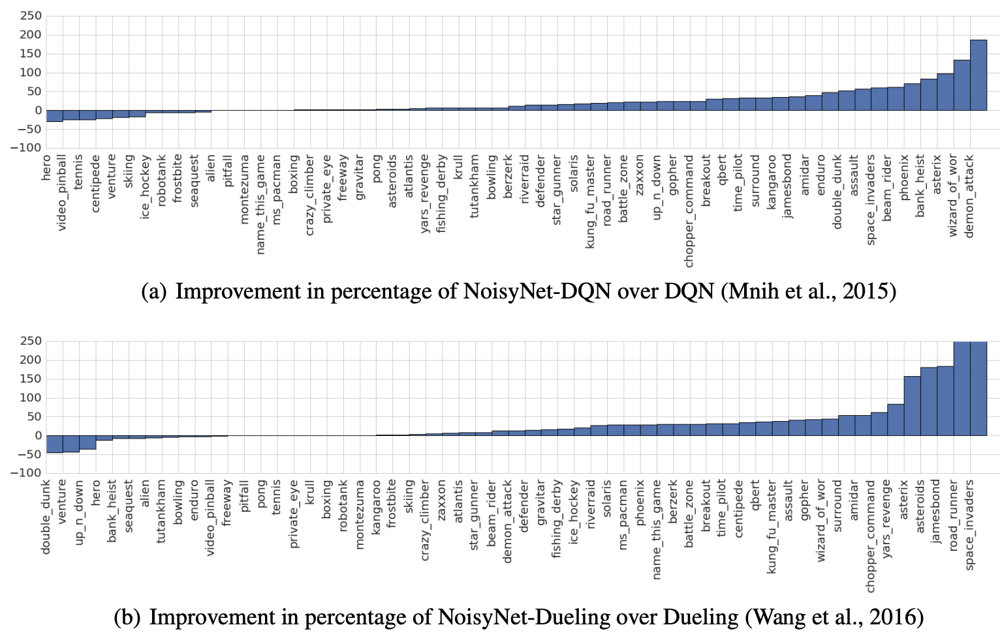

# [Noisy Linear Layer](https://paperswithcode.com/method/noisy-net)

A **Noisy Linear Layer** is a linear layer with parametric noise added to the weights. This induced stochasticity can be used in reinforcement learning networks for the agent's policy to aid efficient exploration. The parameters of the noise are learned with gradient descent along with any other remaining network weights. Factorized Gaussian noise is the type of noise usually employed.

The noisy linear layer takes the form:

$$y = \left(b + Wx\right) + \left(b_{noisy}\odot\epsilon^{b}+\left(W_{noisy}\odot\epsilon^{w}\right)x\right) $$

where $\epsilon^{b}$ and $\epsilon^{w}$ are random variables.

source: [source](https://arxiv.org/abs/1706.10295v3)
