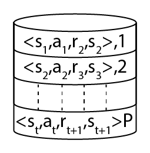
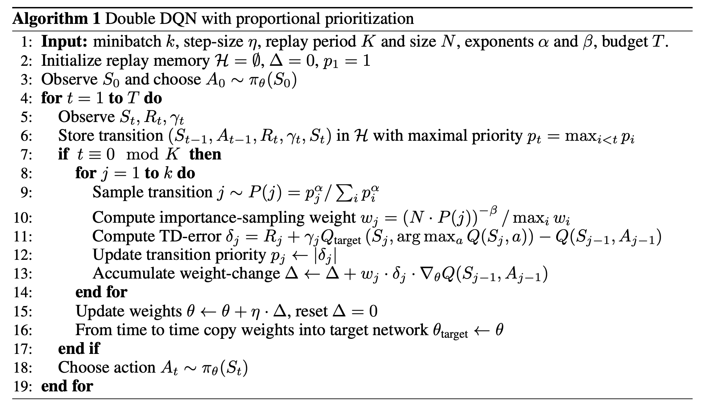

# [Experience Replay](https://paperswithcode.com/method/experience-replay)

**Experience Replay** is a replay memory technique used in reinforcement learning where we store the agent’s experiences at each time-step, $e_{t} = \left(s_{t}, a_{t}, r_{t}, s_{t+1}\right)$ in a data-set $D = e_{1}, \cdots, e_{N}$ , pooled over many episodes into a replay memory. We then usually sample the memory randomly for a minibatch of experience, and use this to learn off-policy, as with Deep Q-Networks. This tackles the problem of autocorrelation leading to unstable training, by making the problem more like a supervised learning problem.

Image Credit: [Hands-On Reinforcement Learning with Python, Sudharsan Ravichandiran](https://subscription.packtpub.com/book/big_data_and_business_intelligence/9781788836524)

# [Prioritized Experience Replay](https://paperswithcode.com/method/prioritized-experience-replay)

**Prioritized Experience Replay** is a type of experience replay in reinforcement learning where we In more frequently replay transitions with high expected learning progress, as measured by the magnitude of their temporal-difference (TD) error. This prioritization can lead to a loss of diversity, which is alleviated with stochastic prioritization, and introduce bias, which can be corrected with importance sampling.

The stochastic sampling method interpolates between pure greedy prioritization and uniform random sampling. The probability of being sampled is ensured to be monotonic in a transition's priority,  while guaranteeing a non-zero probability even for the lowest-priority transition. Concretely, define the probability of sampling transition $i$ as

$$P(i) = \frac{p_i^{\alpha}}{\sum_k p_k^{\alpha}}$$

where $p_i &gt; 0$ is the priority of transition $i$. The exponent $\alpha$ determines how much prioritization is used, with $\alpha=0$ corresponding to the uniform case.

Prioritized replay introduces bias because it changes this distribution in an uncontrolled fashion, and therefore changes the solution that the estimates will converge to. We can correct this bias by using
importance-sampling (IS) weights:

$$ w_{i} = \left(\frac{1}{N}\cdot\frac{1}{P\left(i\right)}\right)^{\beta} $$

that fully compensates for the non-uniform probabilities $P\left(i\right)$ if $\beta = 1$. These weights can be folded into the Q-learning update by using $w_{i}\delta_{i}$ instead of $\delta_{i}$ - weighted IS rather than ordinary IS. For stability reasons, we always normalize weights by $1/\max_{i}w_{i}$ so
that they only scale the update downwards.

The two types of prioritization are proportional based, where $p_{i} = |\delta_{i}| + \epsilon$ and rank-based, where $p_{i} = \frac{1}{\text{rank}\left(i\right)}$, the latter where $\text{rank}\left(i\right)$ is the rank of transition $i$ when the replay memory is sorted according to |$\delta_{i}$|, For proportional based, hyperparameters used were $\alpha = 0.7$, $\beta_{0} = 0.5$. For the rank-based variant, hyperparameters used were $\alpha = 0.6$, $\beta_{0} = 0.4$.

source: [source](http://arxiv.org/abs/1511.05952v4)
