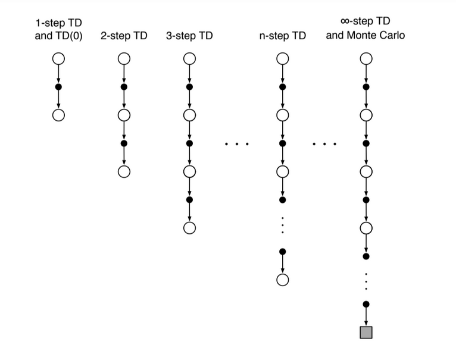
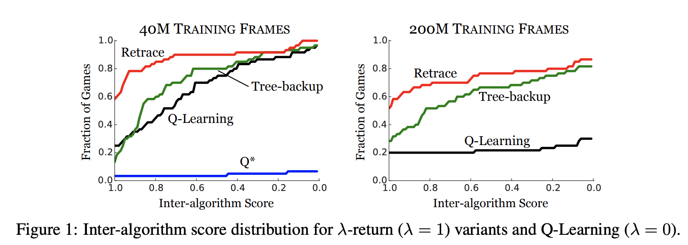
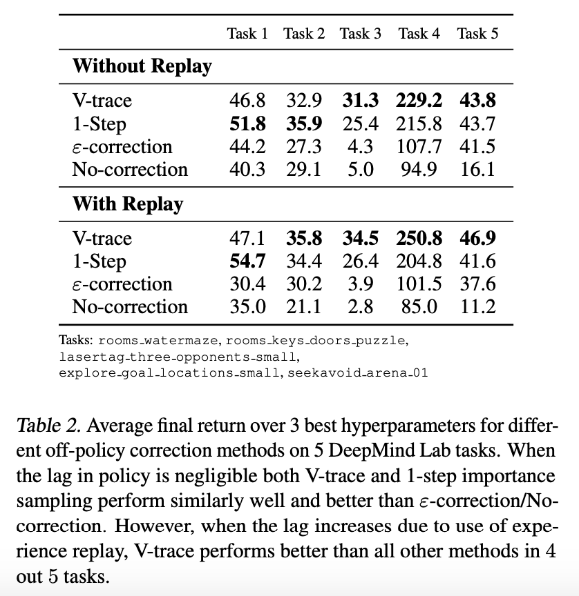
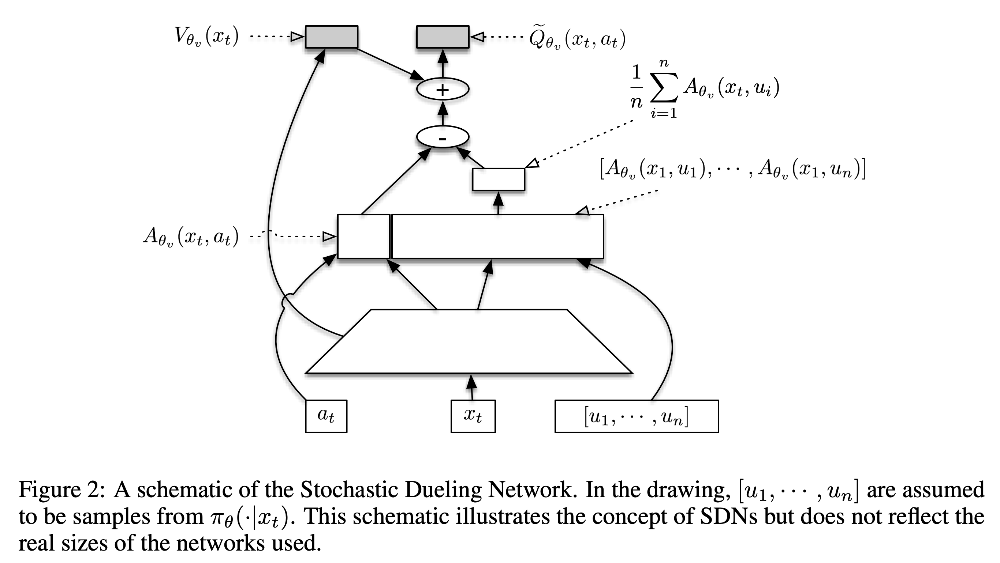

# [N-step Returns](https://paperswithcode.com/method/n-step-returns)

**$n$-step Returns** are used for value function estimation in reinforcement learning. Specifically, for $n$ steps we can write the complete return as:

$$ R_{t}^{(n)} = r_{t+1} + \gamma{r}_{t+2} + \cdots + \gamma^{n-1}_{t+n} + \gamma^{n}V_{t}\left(s_{t+n}\right) $$

We can then write an $n$-step backup, in the style of TD learning, as:

$$ \Delta{V}_{r}\left(s_{t}\right) = \alpha\left[R_{t}^{(n)} - V_{t}\left(s_{t}\right)\right] $$

Multi-step returns often lead to faster learning with suitably tuned $n$.

Image Credit: Sutton and Barto, Reinforcement Learning

# [Retrace](https://paperswithcode.com/method/retrace)

**Retrace** is an off-policy Q-value estimation algorithm which has guaranteed convergence for a target and behaviour policy $\left(\pi, \beta\right)$. With off-policy rollout for TD learning, we must use importance sampling for the update:

$$ \Delta{Q}^{\text{imp}}\left(S_{t}, A_{t}\right) = \gamma^{t}\prod_{1\leq{\tau}\leq{t}}\frac{\pi\left(A_{\tau}\mid{S_{\tau}}\right)}{\beta\left(A_{\tau}\mid{S_{\tau}}\right)}\delta_{t} $$

This product term can lead to high variance, so Retrace modifies $\Delta{Q}$ to have importance weights truncated by no more than a constant $c$:

$$ \Delta{Q}^{\text{imp}}\left(S_{t}, A_{t}\right) = \gamma^{t}\prod_{1\leq{\tau}\leq{t}}\min\left(c, \frac{\pi\left(A_{\tau}\mid{S_{\tau}}\right)}{\beta\left(A_{\tau}\mid{S_{\tau}}\right)}\right)\delta_{t} $$

source: [source](http://arxiv.org/abs/1606.02647v2)
# [V-trace](https://paperswithcode.com/method/v-trace)

**V-trace** is an off-policy actor-critic reinforcement learning algorithm that helps tackle the lag between when actions are generated by the actors and when the learner estimates the gradient. Consider a trajectory $\left(x_{t}, a_{t}, r_{t}\right)^{t=s+n}_{t=s}$ generated by the actor following some policy $\mu$. We can define the $n$-steps V-trace target for $V\left(x_{s}\right)$, our value approximation at state $x_{s}$ as:

$$ v_{s} = V\left(x_{s}\right) + \sum^{s+n-1}_{t=s}\gamma^{t-s}\left(\prod^{t-1}_{i=s}c_{i}\right)\delta_{t}V $$

Where $\delta_{t}V = \rho_{t}\left(r_{t} + \gamma{V}\left(x_{t+1}\right) - V\left(x_{t}\right)\right)$ is a temporal difference algorithm for $V$, and $\rho_{t} = \text{min}\left(\bar{\rho}, \frac{\pi\left(a_{t}\mid{x_{t}}\right)}{\mu\left(a_{t}\mid{x_{t}}\right)}\right)$ and $c_{i} = \text{min}\left(\bar{c}, \frac{\pi\left(a_{t}\mid{x_{t}}\right)}{\mu\left(a_{t}\mid{x_{t}}\right)}\right)$ are truncated importance sampling weights. We assume that the truncation levels are such that $\bar{\rho} \geq \bar{c}$.

source: [source](http://arxiv.org/abs/1802.01561v3)
# [Stochastic Dueling Network](https://paperswithcode.com/method/stochastic-dueling-network)

A **Stochastic Dueling Network**, or **SDN**, is an architecture for learning a value function $V$. The SDN learns both $V$ and $Q$ off-policy while maintaining consistency between the two estimates. At each time step it outputs a stochastic estimate of $Q$ and a deterministic estimate of $V$.

source: [source](http://arxiv.org/abs/1611.01224v2)
