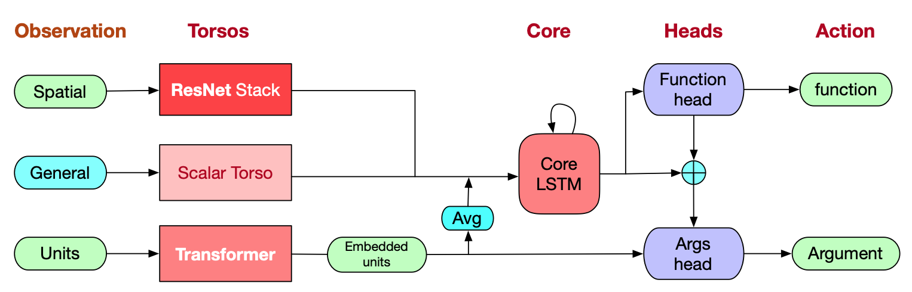

# [AlphaStar](https://paperswithcode.com/method/alphastar)

**AlphaStar** is a reinforcement learning agent for tackling the game of Starcraft II. It learns a policy $\pi_{\theta}\left(a_{t}\mid{s_{t}}, z\right) = P\left[a_{t}\mid{s_{t}}, z\right]$ using a neural network for parameters $\theta$ that receives observations $s_{t} = \left(o_{1:t}, a_{1:t-1}\right)$ as inputs and chooses actions as outputs. Additionally, the policy conditions on a statistic $z$ that summarizes a strategy sampled from human data such as a build order.

AlphaStar uses numerous types of architecture to incorporate different types of features. Observations of player and enemy units are processed with a Transformer. Scatter connections are used to integrate spatial and non-spatial information. The temporal sequence of observations is processed by a core LSTM. Minimap features are extracted with a Residual Network. To manage the combinatorial action space, the agent uses an autoregressive policy and a recurrent pointer network.

The agent is trained first with supervised learning from human replays. Parameters are subsequently trained using reinforcement learning that maximizes win rate against opponents.  The RL algorithm is based on a policy-gradient algorithm similar to actor-critic. Updates are performed asynchronously and off-policy. To deal with this, a combination of $TD\left(\lambda\right)$ and V-trace are used, as well as a new self-imitation algorithm (UPGO).

Lastly, to address game-theoretic challenges, AlphaStar is trained with league training to try to approximate a fictitious self-play (FSP) setting which avoids cycles by computing a best response against a uniform mixture of all previous policies. The league of potential opponents includes a diverse range of agents, including policies from current and previous agents.

Image Credit: [ychai](https://ychai.uk/notes/2019/07/21/RL/DRL/Decipher-AlphaStar-on-StarCraft-II/)

