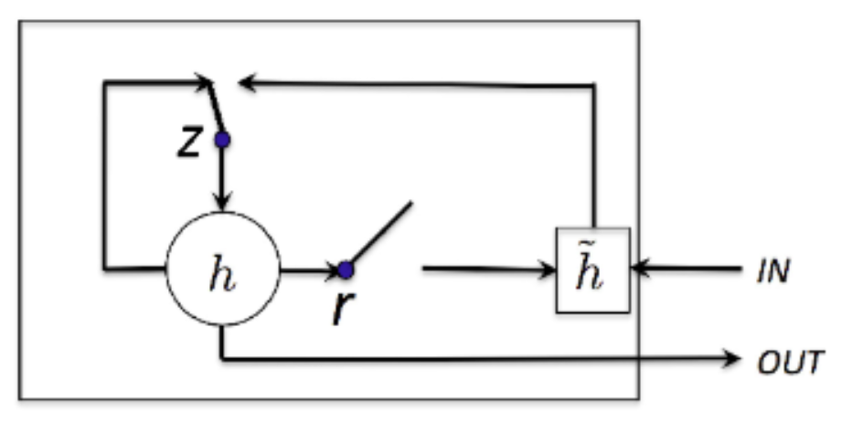
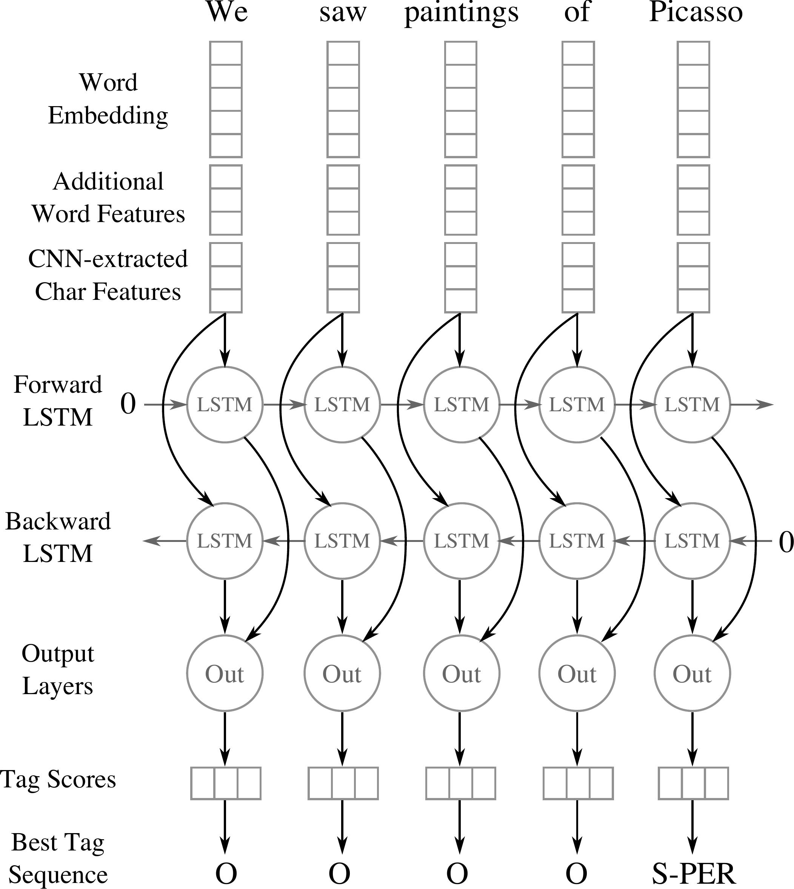

# [BiLSTM](https://paperswithcode.com/method/bilstm)

A **Bidirectional LSTM**, or **biLSTM**, is a sequence processing model that consists of two LSTMs: one taking the input in a forward direction, and the other in a backwards direction. BiLSTMs effectively increase the amount of information available to the network, improving the context available to the algorithm (e.g. knowing what words immediately follow **and** precede a word in a sentence).

Image Source: Modelling Radiological Language with Bidirectional Long Short-Term Memory Networks, Cornegruta et al

# [BiGRU](https://paperswithcode.com/method/bigru)

A **Bidirectional GRU**, or **BiGRU**, is a sequence processing model that consists of two [GRUs](https://paperswithcode.com/method/gru). one taking the input in a forward direction, and the other in a backwards direction. It is a bidirectional recurrent neural network with only the input and forget gates.

Image Source: **Rana R (2016). Gated Recurrent Unit (GRU) for Emotion Classification from Noisy Speech.**

# [CNN BiLSTM](https://paperswithcode.com/method/cnn-bilstm)

A **CNN BiLSTM** is a hybrid bidirectional LSTM and CNN architecture. In the original formulation applied to named entity recognition, it learns both character-level and word-level features. The CNN component is used to induce the character-level features. For each word the model employs a convolution and a max pooling layer to extract a new feature vector from the per-character feature vectors such as character embeddings and (optionally) character type.

source: [source](http://arxiv.org/abs/1511.08308v5)
