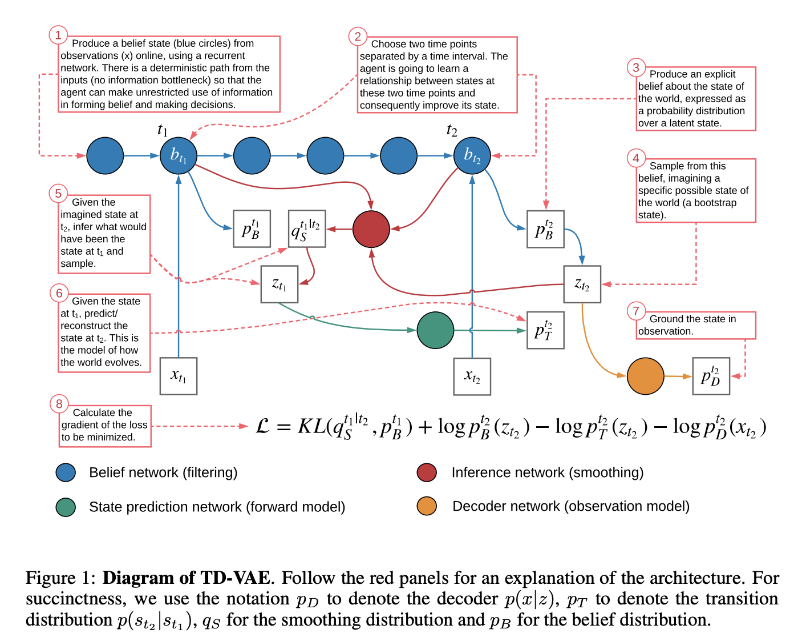

# [TD-VAE](https://paperswithcode.com/method/td-vae)

**TD-VAE**, or **Temporal Difference VAE**, is a generative sequence model that learns representations containing explicit beliefs about states several steps into the future, and that can be rolled out directly without single-step transitions. TD-VAE is trained on pairs of temporally separated time points, using an analogue of [temporal difference learning](https://paperswithcode.com/method/td-lambda) used in reinforcement learning.

source: [source](http://arxiv.org/abs/1806.03107v3)
