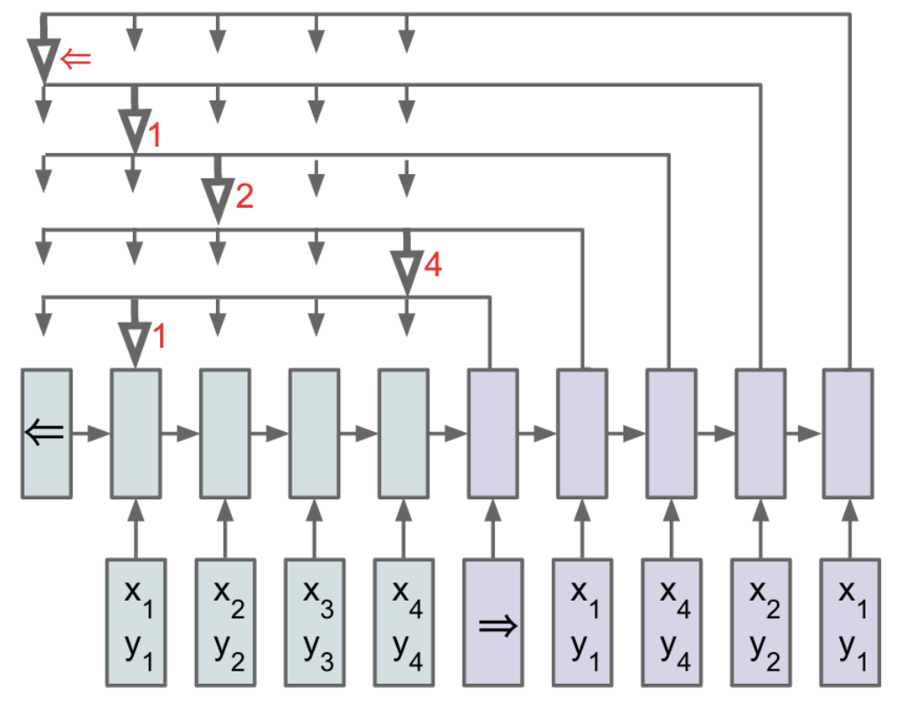
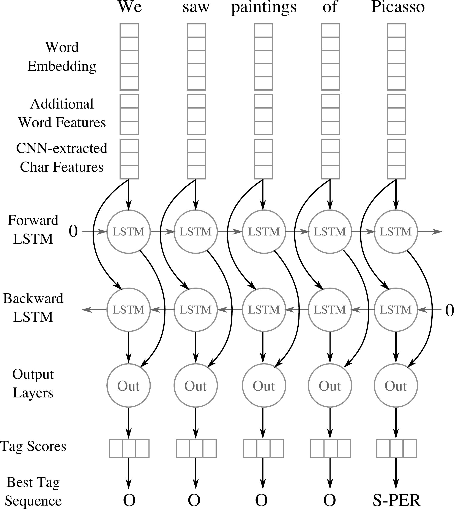
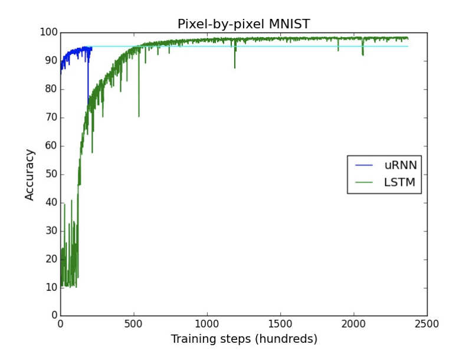
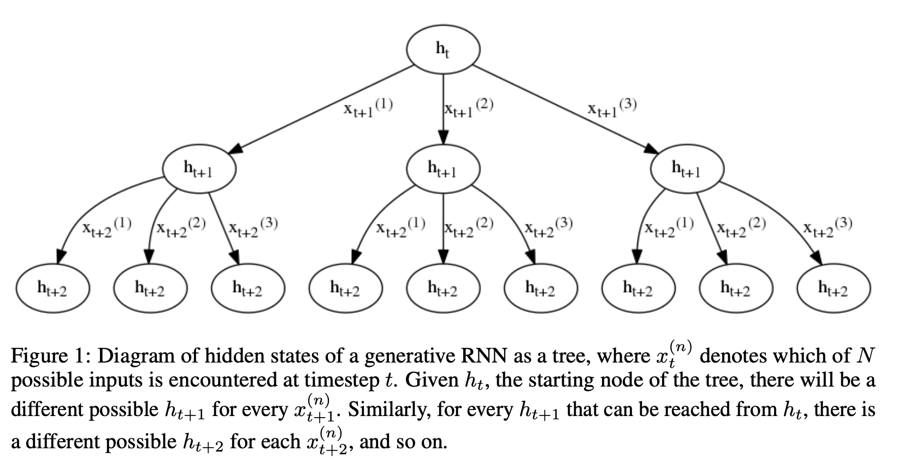

# [LSTM](https://paperswithcode.com/method/lstm)

An **LSTM** is a type of [recurrent neural network](https://paperswithcode.com/methods/category/recurrent-neural-networks) that addresses the vanishing gradient problem in vanilla RNNs through additional cells, input and output gates. Intuitively, vanishing gradients are solved through additional **additive** components, and forget gate activations, that allow the gradients to flow through the network without vanishing as quickly.

(Image Source [here](https://medium.com/datadriveninvestor/how-do-lstm-networks-solve-the-problem-of-vanishing-gradients-a6784971a577))

(Introduced by Hochreiter and Schmidhuber)

# [BiLSTM](https://paperswithcode.com/method/bilstm)

A **Bidirectional LSTM**, or **biLSTM**, is a sequence processing model that consists of two LSTMs: one taking the input in a forward direction, and the other in a backwards direction. BiLSTMs effectively increase the amount of information available to the network, improving the context available to the algorithm (e.g. knowing what words immediately follow **and** precede a word in a sentence).

Image Source: Modelling Radiological Language with Bidirectional Long Short-Term Memory Networks, Cornegruta et al

# [GRU](https://paperswithcode.com/method/gru)

A **Gated Recurrent Unit**, or **GRU**, is a type of recurrent neural network. It is similar to an [LSTM](https://paperswithcode.com/method/lstm), but only has two gates - a reset gate and an update gate - and notably lacks an output gate. Fewer parameters means GRUs are generally easier/faster to train than their LSTM counterparts.

Image Source: [here](https://www.google.com/url?sa=i&amp;url=https%3A%2F%2Fcommons.wikimedia.org%2Fwiki%2FFile%3AGated_Recurrent_Unit%2C_type_1.svg&amp;psig=AOvVaw3EmNX8QXC5hvyxeenmJIUn&amp;ust=1590332062671000&amp;source=images&amp;cd=vfe&amp;ved=0CA0QjhxqFwoTCMiev9-eyukCFQAAAAAdAAAAABAR)

source: [source](http://arxiv.org/abs/1406.1078v3)
# [Pointer Network](https://paperswithcode.com/method/pointer-net)

**Pointer Networks** tackle problems where input and output data are sequential data, but can't be solved by seq2seq type models because discrete categories of output elements depend on the variable input size (and are not decided in advance).

A Pointer Network learns the conditional  probability of an output sequence with elements that are discrete tokens corresponding to positions in an input sequence. They solve the problem of variable size output dictionaries using additive attention. But instead of using attention to blend hidden units of an encoder to a context vector at each decoder step, Pointer Networks use attention as a pointer to select a member of the input sequence as the output. 

Pointer-Nets can be used to learn approximate solutions to challenging geometric problems such as finding planar convex hulls, computing Delaunay triangulations, and the planar Travelling Salesman Problem.

source: [source](http://arxiv.org/abs/1506.03134v2)
# [BiGRU](https://paperswithcode.com/method/bigru)

A **Bidirectional GRU**, or **BiGRU**, is a sequence processing model that consists of two [GRUs](https://paperswithcode.com/method/gru). one taking the input in a forward direction, and the other in a backwards direction. It is a bidirectional recurrent neural network with only the input and forget gates.

Image Source: **Rana R (2016). Gated Recurrent Unit (GRU) for Emotion Classification from Noisy Speech.**

# [AWD-LSTM](https://paperswithcode.com/method/awd-lstm)

**ASGD Weight-Dropped LSTM**, or **AWD-LSTM**, is a type of recurrent neural network that employs [DropConnect](https://paperswithcode.com/method/dropconnect) for regularization, as well as [NT-ASGD](https://paperswithcode.com/method/nt-asgd) for optimization - non-monotonically triggered averaged SGD - which returns an average of last iterations of weights. Additional regularization techniques employed include variable length backpropagation sequences, [variational dropout](https://paperswithcode.com/method/variational-dropout), [embedding dropout](https://paperswithcode.com/method/embedding-dropout), weight tying, independent embedding/hidden size, [activation regularization](https://paperswithcode.com/method/activation-regularization) and [temporal activation regularization](https://paperswithcode.com/method/temporal-activation-regularization).

source: [source](http://arxiv.org/abs/1708.02182v1)
# [Residual GRU](https://paperswithcode.com/method/residual-gru)

A **Residual GRU** is a [gated recurrent unit (GRU)](https://paperswithcode.com/method/gru) that incorporates the idea of residual connections from [ResNets](https://paperswithcode.com/method/resnet).

source: [source](http://arxiv.org/abs/1608.05148v2)
# [Neural Turing Machine](https://paperswithcode.com/method/neural-turing-machine)

A **Neural Turing Machine** is a working memory neural network model. It couples a neural network architecture with external memory resources. The whole architecture is differentiable end-to-end with gradient descent. The models can infer tasks such as copying, sorting and associative recall.

source: [source](http://arxiv.org/abs/1410.5401v2)
# [WaveRNN](https://paperswithcode.com/method/wavernn)

**WaveRNN** is a single-layer recurrent neural network for audio generation that is designed efficiently predict 16-bit raw audio samples.

The overall computation in the WaveRNN is as follows (biases omitted for brevity):

$$ \mathbf{x}_{t} = \left[\mathbf{c}_{t−1},\mathbf{f}_{t−1}, \mathbf{c}_{t}\right] $$

$$ \mathbf{u}_{t} = \sigma\left(\mathbf{R}_{u}\mathbf{h}_{t-1} + \mathbf{I}^{*}_{u}\mathbf{x}_{t}\right) $$

$$ \mathbf{r}_{t} = \sigma\left(\mathbf{R}_{r}\mathbf{h}_{t-1} + \mathbf{I}^{*}_{r}\mathbf{x}_{t}\right) $$

$$ \mathbf{e}_{t} = \tau\left(\mathbf{r}_{t} \odot \left(\mathbf{R}_{e}\mathbf{h}_{t-1}\right) + \mathbf{I}^{*}_{e}\mathbf{x}_{t} \right) $$

$$ \mathbf{h}_{t} = \mathbf{u}_{t} \cdot \mathbf{h}_{t-1} + \left(1-\mathbf{u}_{t}\right) \cdot \mathbf{e}_{t} $$

$$ \mathbf{y}_{c}, \mathbf{y}_{f} = \text{split}\left(\mathbf{h}_{t}\right) $$

$$ P\left(\mathbf{c}_{t}\right) = \text{softmax}\left(\mathbf{O}_{2}\text{relu}\left(\mathbf{O}_{1}\mathbf{y}_{c}\right)\right) $$

$$ P\left(\mathbf{f}_{t}\right) = \text{softmax}\left(\mathbf{O}_{4}\text{relu}\left(\mathbf{O}_{3}\mathbf{y}_{f}\right)\right) $$

where the $*$ indicates a masked matrix whereby the last coarse input $\mathbf{c}_{t}$ is only connected to the fine part of the states $\mathbf{u}_{t}$, $\mathbf{r}_{t}$, $\mathbf{e}_{t}$ and $\mathbf{h}_{t}$ and thus only affects the fine output $\mathbf{y}_{f}$. The coarse and fine parts $\mathbf{c}_{t}$ and $\mathbf{f}_{t}$ are encoded as scalars in $\left[0, 255\right]$ and scaled to the interval $\left[−1, 1\right]$. The matrix $\mathbf{R}$ formed from the matrices $\mathbf{R}_{u}$, $\mathbf{R}_{r}$, $\mathbf{R}_{e}$ is computed as a single matrix-vector product to produce the contributions to all three gates $\mathbf{u}_{t}$, $mathbf{r}_{t}$ and $\mathbf{e}_{t}$ (a variant of the [GRU cell](https://paperswithcode.com/method/gru). $\sigma$ and $\tau$ are the standard sigmoid and tanh non-linearities.

Each part feeds into a softmax layer over the corresponding 8 bits and the prediction of the 8 fine bits is conditioned on the 8 coarse bits. The resulting Dual Softmax layer allows for efficient prediction of 16-bit samples using two small output spaces (2 8 values each) instead of a single large output space (with 2 16 values).

source: [source](http://arxiv.org/abs/1802.08435v2)
# [CNN BiLSTM](https://paperswithcode.com/method/cnn-bilstm)

A **CNN BiLSTM** is a hybrid bidirectional LSTM and CNN architecture. In the original formulation applied to named entity recognition, it learns both character-level and word-level features. The CNN component is used to induce the character-level features. For each word the model employs a convolution and a max pooling layer to extract a new feature vector from the per-character feature vectors such as character embeddings and (optionally) character type.

source: [source](http://arxiv.org/abs/1511.08308v5)
# [QRNN](https://paperswithcode.com/method/qrnn)

A **QRNN**, or **Quasi-Recurrent Neural Network**, is a type of recurrent neural network that alternates convolutional layers, which apply in parallel across timesteps, and a minimalist recurrent pooling function that applies in parallel across channels. Due to their increased parallelism, they can be up to 16 times faster at train and test time than [LSTMs](https://paperswithcode.com/method/lstm).

Given an input sequence $\mathbf{X} \in \mathbb{R}^{T\times{n}}$ of $T$ n-dimensional vectors $\mathbf{x}_{1}, \dots, \mathbf{x}_{T}$, the convolutional subcomponent of a QRNN performs convolutions in the timestep dimension with a bank of $m$ filters, producing a sequence $\mathbf{Z} \in \mathbb{R}^{T\times{m}}$ of m-dimensional candidate vectors $\mathbf{z}_{t}$. Masked convolutions are used so filters can not access information from future timesteps (implementing with left padding).

Additional convolutions are applied with separate filter banks to obtain sequences of vectors for the
elementwise gates that are needed for the pooling function. While the candidate vectors are passed
through a $\tanh$ nonlinearity, the gates use an elementwise sigmoid. If the pooling function requires a
forget gate $f_{t}$ and an output gate $o_{t}$ at each timestep, the full set of computations in the convolutional component is then:

$$ \mathbf{Z} = \tanh\left(\mathbf{W}_{z} ∗ \mathbf{X}\right) $$
$$ \mathbf{F} = \sigma\left(\mathbf{W}_{f} ∗ \mathbf{X}\right) $$
$$ \mathbf{O} = \sigma\left(\mathbf{W}_{o} ∗ \mathbf{X}\right) $$

where $\mathbf{W}_{z}$, $\mathbf{W}_{f}$, and $\mathbf{W}_{o}$, each in $\mathbb{R}^{k×n×m}$, are the convolutional filter banks and ∗ denotes a masked convolution along the timestep dimension.  Dynamic average pooling by Balduzzi &amp; Ghifary (2016) is used, which uses only a forget gate:

$$ \mathbf{h}_{t} = \mathbf{f}_{t} \odot{\mathbf{h}_{t−1}} + \left(1 − \mathbf{f}_{t}\right) \odot{?\mathbf{z}_{t}} $$ 

Which is denoted f-pooling. The function may also include an output gate:

$$ \mathbf{c}_{t} = \mathbf{f}_{t} \odot{\mathbf{c}_{t−1}} + \left(1 − \mathbf{f}_{t}\right) \odot{?\mathbf{z}_{t}} $$ 

$$ \mathbf{h}_{t} = \mathbf{o}_{t} \odot{\mathbf{c}_{t}} $$

Which is denoted fo-pooling. Or the recurrence relation may include an independent input and forget gate:

$$ \mathbf{c}_{t} = \mathbf{f}_{t} \odot{\mathbf{c}_{t−1}} + \mathbf{i}_{t}\odot{?\mathbf{z}_{t}} $$ 

$$ \mathbf{h}_{t} = \mathbf{o}_{t} \odot{\mathbf{c}_{t}} $$

Which is denoted ifo-pooling. In each case $h$ or $c$ is initialized to zero. The recurrent part sof these functions must be calculated for each timestep in the sequence, but parallelism along feature dimensions means evaluating them even over long sequences requires a negligible amount of computation time.

A single QRNN layer thus performs an input-dependent pooling, followed by a gated linear combination of convolutional features. As with convolutional neural networks, two or more QRNN layers should be stacked to create a model with the capacity to approximate more complex functions.

source: [source](http://arxiv.org/abs/1611.01576v2)
# [CRF-RNN](https://paperswithcode.com/method/crf-rnn)

**CRF-RNN** is a formulation of a [CRF](https://paperswithcode.com/method/crf) as a Recurrent Neural Network. Specifically it formulates mean-field approximate inference for the Conditional Random Fields with Gaussian pairwise potentials as Recurrent Neural Networks.

source: [source](http://arxiv.org/abs/1502.03240v3)
# [CGRU](https://paperswithcode.com/method/cgru)

A **Convolutional Gated Recurrent Unit** is a type of [GRU](https://paperswithcode.com/method/gru) that combines GRUs with the convolution operation. The update rule for input $x_{t}$ and the previous output $h_{t-1}$ is given by the following:

$$ r = \sigma\left(W_{r} \star_{n}\left[h_{t-1};x_{t}\right] + b_{r}\right) $$

$$ u = \sigma\left(W_{u} \star_{n}\left[h_{t-1};x_{t}\right] + b_{u} \right) $$

$$ c = \rho\left(W_{c} \star_{n}\left[x_{t}; r \odot h_{t-1}\right] + b_{c} \right) $$

$$ h_{t} = u \odot h_{t-1} + \left(1-u\right) \odot c $$

In these equations $\sigma$ and $\rho$ are the elementwise sigmoid and ReLU functions respectively and the $\star_{n}$ represents a convolution with a kernel of size $n \times n$. Brackets are used to represent a feature concatenation.

source: [source](http://arxiv.org/abs/1511.06432v4)
# [Unitary RNN](https://paperswithcode.com/method/unitary-rnn)

A **Unitary RNN** is a recurrent neural network architecture that uses a unitary hidden to hidden matrix. Specifically they concern dynamics of the form:

$$ h_{t} = f\left(Wh_{t−1} + Vx_{t}\right) $$

where $W$ is a unitary matrix $\left(W^{†}W = I\right)$. The product of unitary matrices is a unitary matrix, so $W$ can be parameterised as a product of simpler unitary matrices:

$$ h_{t} = f\left(D_{3}R_{2}F^{−1}D_{2}PR_{1}FD_{1}h_{t−1} + Vxt\right) $$

where $D_{3}$, $D_{2}$, $D_{1}$ are learned diagonal complex matrices, and $R_{2}$, $R_{1}$ are learned reflection matrices. Matrices $F$ and $F^{−1}$ are the discrete Fourier transformation and its inverse. P is any constant random permutation. The activation function $f\left(h\right)$ applies a rectified linear unit with a learned bias to the modulus of each complex number. Only
the diagonal and reflection matrices, $D$ and $R$, are learned, so Unitary RNNs have fewer parameters than [LSTMs](https://paperswithcode.com/method/lstm) with comparable numbers of hidden units.

Source: [Associative LSTMs](https://arxiv.org/pdf/1602.03032.pdf)

source: [source](http://arxiv.org/abs/1511.06464v4)
# [Mogrifier LSTM](https://paperswithcode.com/method/mogrifier-lstm)

The **Mogrifier LSTM** is an extension to the [LSTM](https://paperswithcode.com/method/lstm) where the LSTM’s input $\mathbf{x}$ is gated conditioned on the output of the previous step $\mathbf{h}_{prev}$. Next, the gated input is used in a similar manner to gate the output of the
previous time step. After a couple of rounds of this mutual gating, the last updated $\mathbf{x}$ and $\mathbf{h}_{prev}$ are fed to an LSTM.  

In detail, the Mogrifier is an LSTM where two inputs $\mathbf{x}$ and $\mathbf{h}_{prev}$ modulate one another in an alternating fashion before the usual LSTM computation takes place. That is: $ \text{Mogrify}\left(\mathbf{x}, \mathbf{c}_{prev}, \mathbf{h}_{prev}\right) = \text{LSTM}\left(\mathbf{x}^{↑}, \mathbf{c}_{prev}, \mathbf{h}^{↑}_{prev}\right)$ where the modulated inputs $\mathbf{x}^{↑}$ and $\mathbf{h}^{↑}_{prev}$ are defined as the highest indexed $\mathbf{x}^{i}$ and $\mathbf{h}^{i}_{prev}$, respectively, from the interleaved sequences:

$$ \mathbf{x}^{i} = 2\sigma\left(\mathbf{Q}^{i}\mathbf{h}^{i−1}_{prev}\right) \odot x^{i-2} \text{ for odd } i \in \left[1 \dots r\right] $$

$$ \mathbf{h}^{i}_{prev}  = 2\sigma\left(\mathbf{R}^{i}\mathbf{x}^{i-1}\right) \odot \mathbf{h}^{i-2}_{prev} \text{ for even } i \in \left[1 \dots r\right] $$

with $\mathbf{x}^{-1} = \mathbf{x}$ and $\mathbf{h}^{0}_{prev} = \mathbf{h}_{prev}$. The number of "rounds", $r \in \mathbb{N}$, is a hyperparameter; $r = 0$ recovers the LSTM. Multiplication with the constant 2 ensures that randomly initialized $\mathbf{Q}^{i}$, $\mathbf{R}^{i}$ matrices result in transformations close to identity. To reduce the number of additional model parameters, we typically factorize the $\mathbf{Q}^{i}$, $\mathbf{R}^{i}$ matrices as products of low-rank matrices: $\mathbf{Q}^{i}$ =
$\mathbf{Q}^{i}_{left}\mathbf{Q}^{i}_{right}$ with $\mathbf{Q}^{i} \in \mathbb{R}^{m\times{n}}$, $\mathbf{Q}^{i}_{left} \in \mathbb{R}^{m\times{k}}$, $\mathbf{Q}^{i}_{right} \in \mathbb{R}^{k\times{n}}$, where $k &lt; \min\left(m, n\right)$ is the rank.

source: [source](https://arxiv.org/abs/1909.01792v2)
# [TSRUs](https://paperswithcode.com/method/tsrus)

**TSRUs**, or **Transformation-based Spatial Recurrent Unit p**, is a modification of a [ConvGRU](https://paperswithcode.com/method/cgru) used in the [TriVD-GAN](https://paperswithcode.com/method/trivd-gan) architecture for video generation.

It largely follows [TSRUc](https://paperswithcode.com/method/tsruc), but computes each intermediate output in a fully sequential manner: like in TSRUc, $c$ is given access to $\hat{h}_{t-1}$, but additionally, $u$ is given access to both outputs $\hat{h}_{t-1}$ and $c$, so as to make an informed decision prior to mixing. This yields the following replacement for $u$:

$$ u = \sigma\left(W_{u} \star_{n}\left[\hat{h}_{t-1};c\right] + b_{u} \right) $$

In these equations $\sigma$ and $\rho$ are the elementwise sigmoid and ReLU functions respectively and the $\star_{n}$ represents a convolution with a kernel of size $n \times n$. Brackets are used to represent a feature concatenation.

source: [source](https://arxiv.org/abs/2003.04035v1)
# [Associative LSTM](https://paperswithcode.com/method/associative-lstm)

An **Associative LSTM** combines an [LSTM](https://paperswithcode.com/method/lstm) with ideas from Holographic Reduced Representations (HRRs) to enable key-value storage of data. HRRs use a “binding” operator to implement key-value
binding between two vectors (the key and its associated content). They natively implement associative arrays; as a byproduct, they can also easily implement stacks, queues, or lists.

source: [source](http://arxiv.org/abs/1602.03032v2)
# [SHA-RNN](https://paperswithcode.com/method/sha-rnn)

**SHA-RNN**, or **Single Headed Attention RNN**, is a recurrent neural network, and language model when combined with an embedding input and softmax classifier, based on a core [LSTM](https://paperswithcode.com/method/lstm) component and a single-headed attention module. Other design choices include a Boom feedforward layer and the use of layer normalization. The guiding principles of the author were to ensure simplicity in the architecture and to keep computational costs bounded (the model was originally trained with a single GPU).

source: [source](https://arxiv.org/abs/1911.11423v2)
# [mLSTM](https://paperswithcode.com/method/mlstm)

A **Multiplicative LSTM (mLSTM)** is a  recurrent neural network architecture for sequence modelling that combines the long short-term memory ([LSTM](https://paperswithcode.com/method/lstm)) and multiplicative recurrent neural network ([mRNN](https://paperswithcode.com/method/mrnn)) architectures. The mRNN and LSTM architectures can be combined by adding connections from the mRNN’s intermediate state $m_{t}$ to each gating units in the LSTM.

source: [source](http://arxiv.org/abs/1609.07959v3)
# [SNAIL](https://paperswithcode.com/method/snail)

The **Simple Neural Attention Meta-Learner**, or **SNAIL**, combines the benefits of temporal convolutions and attention to solve meta-learning tasks. They introduce positional dependence through temporal convolutions to make the model applicable to reinforcement tasks - where the observations, actions, and rewards are intrinsically sequential. They also introduce attention in order to provide pinpoint access over an infinitely large context. SNAIL is constructing by combining the two: we use temporal convolutions to produce the context over which we use a causal attention operation.

source: [source](http://arxiv.org/abs/1707.03141v3)
# [ERU](https://paperswithcode.com/method/eru)

An **Efficient Recurrent Unit (ERU)** extends [LSTM](https://paperswithcode.com/method/mrnn)-based language models by replacing linear transforms for processing the input vector with the EESP unit inside the LSTM cell.

source: [source](http://arxiv.org/abs/1811.11431v3)
# [TSRUc](https://paperswithcode.com/method/tsruc)

**TSRUc**, or **Transformation-based Spatial Recurrent Unit c**, is a modification of a [ConvGRU](https://paperswithcode.com/method/cgru) used in the [TriVD-GAN](https://paperswithcode.com/method/trivd-gan) architecture for video generation.

Instead of computing the reset gate $r$ and resetting $h_{t−1}$, the TSRUc computes the parameters of a transformation $\theta$, which we use to warp $h_{t−1}$. The rest of our model is unchanged (with $\hat{h}_{t-1}$ playing the role of $h'_{t}$ in $c$’s update equation from ConvGRU. The TSRUc module is described by the following equations:

$$ \theta_{h,x} = f\left(h_{t−1}, x_{t}\right) $$

$$ \hat{h}_{t-1} = w\left(h_{t-1}; \theta_{h, x}\right) $$

$$ c = \rho\left(W_{c} \star_{n}\left[\hat{h}_{t-1};x_{t}\right] + b_{c} \right) $$

$$ u = \sigma\left(W_{u} \star_{n}\left[h_{t-1};x_{t}\right] + b_{u} \right) $$

$$ h_{t} = u \odot h_{t-1} + \left(1-u\right) \odot c $$

In these equations $\sigma$ and $\rho$ are the elementwise sigmoid and ReLU functions respectively and the $\star_{n}$ represents a convolution with a kernel of size $n \times n$. Brackets are used to represent a feature concatenation.

source: [source](https://arxiv.org/abs/2003.04035v1)
# [TSRUp](https://paperswithcode.com/method/tsrup)

**TSRUp**, or **Transformation-based Spatial Recurrent Unit p**, is a modification of a [ConvGRU](https://paperswithcode.com/method/cgru) used in the [TriVD-GAN](https://paperswithcode.com/method/trivd-gan) architecture for video generation.

It largely follows [TSRUc](https://paperswithcode.com/method/tsruc), but computes $\theta$, $u$ and $c$ in parallel given $x_{t}$ and $h_{t−1}$, yielding the following replacement for the $c$ update equation:

$$ c = \rho\left(W_{c} \star_{n}\left[h_{t-1}; x_{t}\right] + b_{c} \right) $$

In these equations $\sigma$ and $\rho$ are the elementwise sigmoid and ReLU functions respectively and the $\star_{n}$ represents a convolution with a kernel of size $n \times n$. Brackets are used to represent a feature concatenation.

source: [source](https://arxiv.org/abs/2003.04035v1)
# [mRNN](https://paperswithcode.com/method/mrnn)

A **Multiplicative RNN (mRNN)** is a type of recurrent neural network with multiplicative connections. In a standard RNN, the current input $x_{t}$ is first transformed via the visible-to-hidden weight matrix $W_{hx}$ and then contributes additively to the input for the current hidden state. An mRNN allows the current input (a character in the original example) to affect the hidden state dynamics by determining the entire hidden-to-hidden matrix (which defines the non-linear dynamics) in addition to providing an additive bias.

To achieve this goal, the authors modify the RNN so that its hidden-to-hidden weight matrix is a (learned) function of the current input $x_{t}$:

$$ h_{t} = \tanh\left(W_{hx}x_{t} + W_{hh}^{\left(x_{y}\right)}h_{t-1} + b_{h}\right)$$

$$ o_{t} = W_{oh}h_{t} + b_{o} $$

This is the same as the equations for a standard RNN, except that $W_{hh}$ is replaced with $W^{(xt)}_{hh}$. allowing each input (character) to specify a different hidden-to-hidden weight matrix.

