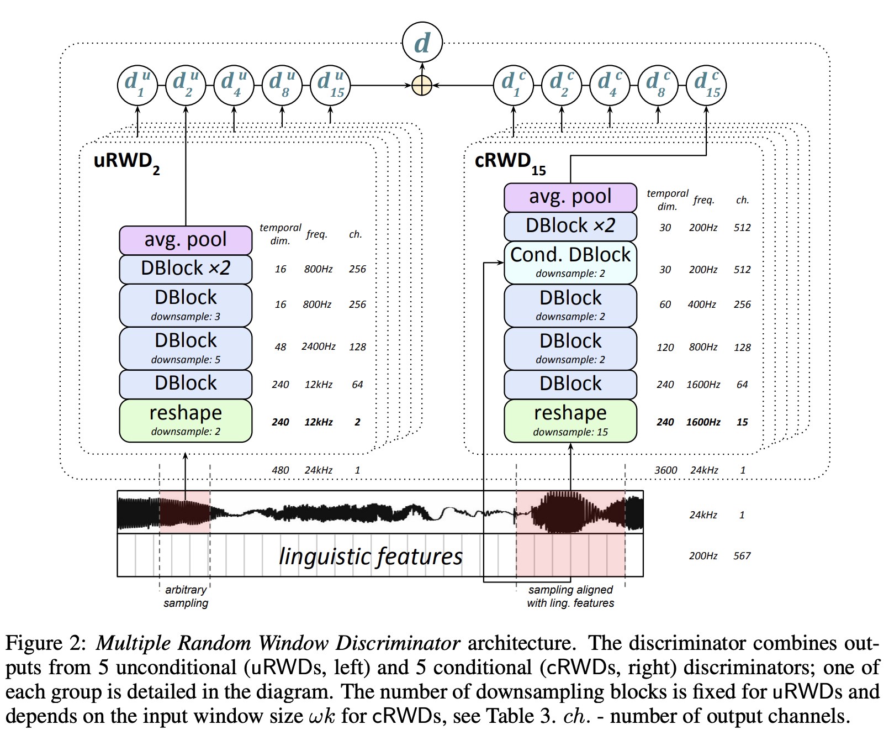

# [Seq2Seq](https://paperswithcode.com/method/seq2seq)

**Seq2Seq**, or **Sequence To Sequence**, is a model used in sequence prediction tasks, such as language modelling and machine translation. The idea is to use one LSTM, the **encoder**, to read the input sequence one timestep at a time, to obtain a large fixed dimensional vector representation (a context vector), and then to use another LSTM, the **decoder**, to extract the output sequence
from that vector. The second LSTM is essentially a recurrent neural network language model except that it is conditioned on the input sequence.

(Note that this page refers to the original seq2seq not general sequence-to-sequence models)

source: [source](http://arxiv.org/abs/1409.3215v3)
# [Pointer Network](https://paperswithcode.com/method/pointer-net)

**Pointer Networks** tackle problems where input and output data are sequential data, but can't be solved by seq2seq type models because discrete categories of output elements depend on the variable input size (and are not decided in advance).

A Pointer Network learns the conditional  probability of an output sequence with elements that are discrete tokens corresponding to positions in an input sequence. They solve the problem of variable size output dictionaries using additive attention. But instead of using attention to blend hidden units of an encoder to a context vector at each decoder step, Pointer Networks use attention as a pointer to select a member of the input sequence as the output. 

Pointer-Nets can be used to learn approximate solutions to challenging geometric problems such as finding planar convex hulls, computing Delaunay triangulations, and the planar Travelling Salesman Problem.

source: [source](http://arxiv.org/abs/1506.03134v2)
# [Tacotron](https://paperswithcode.com/method/tacotron)

**Tacotron** is an end-to-end generative text-to-speech model that takes a character sequence as input and outputs the corresponding spectrogram. The backbone of Tacotron is a seq2seq model with attention. The Figure depicts the model, which includes an encoder, an attention-based decoder, and a post-processing net. At a high-level, the model takes characters as input and produces spectrogram
frames, which are then converted to waveforms.

source: [source](http://arxiv.org/abs/1703.10135v2)
# [BART](https://paperswithcode.com/method/bart)

**BART** is a denoising autoencoder for pretraining sequence-to-sequence models. It is trained by (1) corrupting text with an arbitrary noising function, and (2) learning a model to reconstruct the original text. It uses a standard Transformer-based neural machine translation architecture. It uses a standard seq2seq/NMT architecture with a bidirectional encoder (like [BERT](https://paperswithcode.com/method/bert)) and a left-to-right decoder (like [GPT](https://paperswithcode.com/method/gpt)). This means the encoder's attention mask is fully visible, like BERT, and the decoder's attention mask is causal, like [GPT2](https://paperswithcode.com/method/gpt-2).

source: [source](https://arxiv.org/abs/1910.13461v1)
# [T5](https://paperswithcode.com/method/t5)

**T5**, or **Text-to-Text Transfer Transformer**, is a Transformer based architecture that uses a text-to-text approach. Every task – including translation, question answering, and classification – is cast as feeding the model text as input and training it to generate some target text. This allows for the use of the same model, loss function, hyperparameters, etc. across our diverse set of tasks. The changes compared to [BERT](https://paperswithcode.com/method/bert) include:

- adding a **causal** decoder to the bidirectional architecture.
- replacing the fill-in-the-blank cloze task with a mix of alternative pre-training tasks.

source: [source](https://arxiv.org/abs/1910.10683v2)
# [GAN-TTS](https://paperswithcode.com/method/gan-tts)

**GAN-TTS** is a generative adversarial network for text-to-speech synthesis. The architecture is composed of a conditional feed-forward generator producing raw speech audio, and an ensemble of discriminators which operate on random windows of different sizes. The discriminators analyze the audio both in terms of general realism, as well as how well the audio corresponds to the utterance that should be pronounced.

The generator architecture consists of several GBlocks, which are residual based (dilated) convolution blocks. GBlocks 3–7 gradually upsample the temporal dimension of hidden representations by factors of 2, 2, 2, 3, 5, while the number of channels is reduced by GBlocks 3, 6 and 7 (by a factor of 2 each). The final convolutional layer with Tanh activation produces a single-channel audio waveform.

Instead of a single discriminator, GAN-TTS uses an ensemble of Random Window Discriminators (RWDs) which operate on randomly sub-sampled fragments of the real or generated samples. The ensemble allows for the evaluation of audio in different complementary ways.

source: [source](https://arxiv.org/abs/1909.11646v2)
