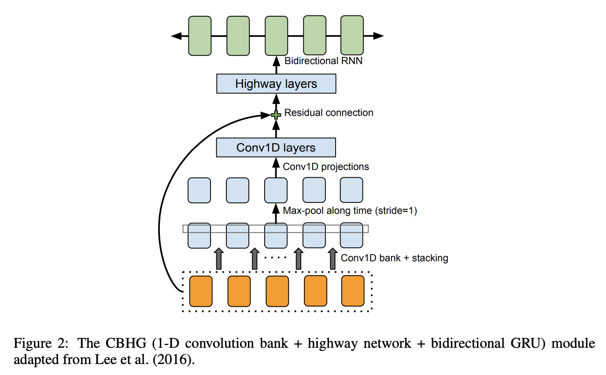

# [CBHG](https://paperswithcode.com/method/cbhg)

**CBHG** is a building block used in the [Tacotron](https://paperswithcode.com/method/tacotron) text-to-speech model. It consists of a
bank of 1-D convolutional filters, followed by highway networks and a bidirectional gated recurrent unit (BiGRU). The module is used to extract representations from sequences. The input sequence is first
convolved with $K$ sets of 1-D convolutional filters, where the $k$-th set contains $C_{k}$ filters of width $k$ (i.e. $k = 1, 2, \dots , K$). These filters explicitly model local and contextual information (akin to modeling unigrams, bigrams, up to K-grams). The convolution outputs are stacked together and further max pooled along time to increase local invariances. A stride of 1 is used to  preserve the original time resolution. The processed sequence is further passed to a few fixed-width 1-D convolutions, whose outputs are added with the original input sequence via residual connections. Batch normalization is used for all convolutional layers. The convolution outputs are fed into a multi-layer highway network to extract high-level features. Finally, a bidirectional GRU RNN is stacked on top to extract sequential features from both forward and backward context.

source: [source](http://arxiv.org/abs/1703.10135v2)
