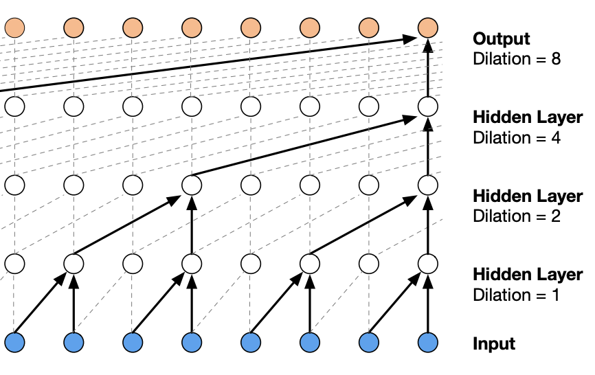
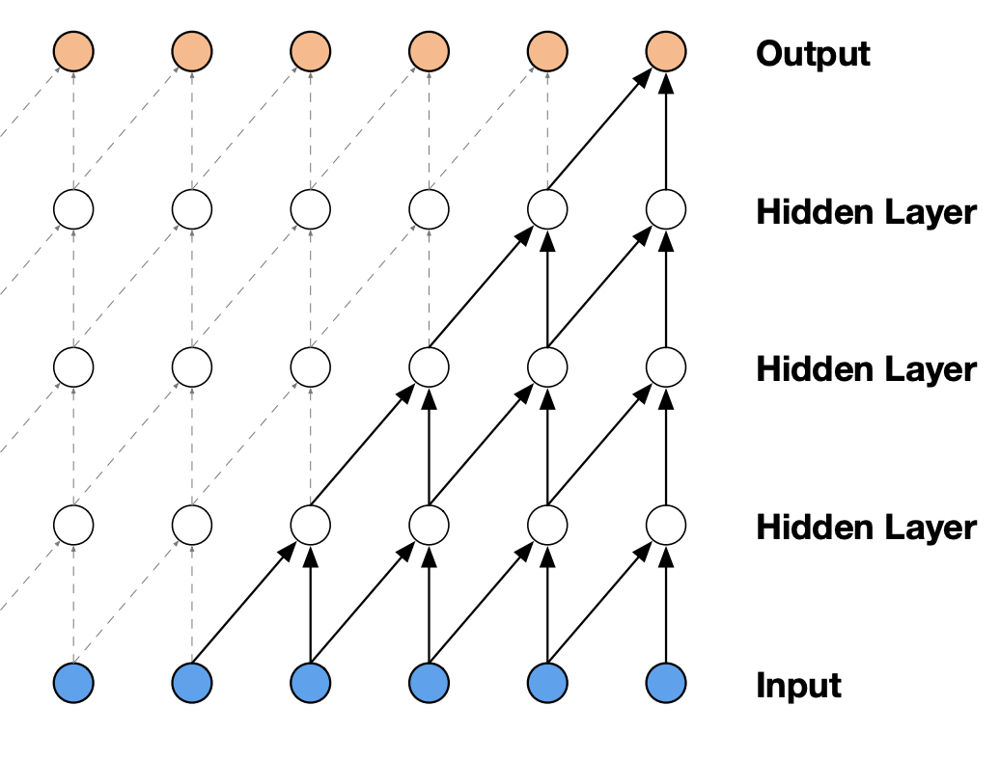
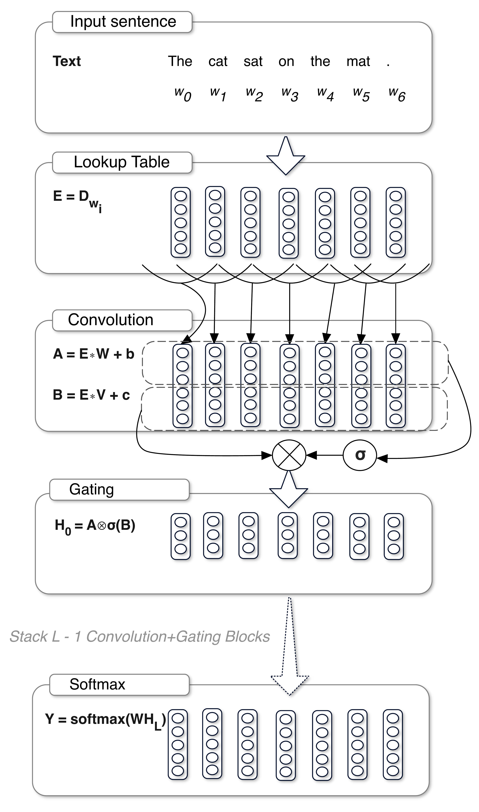
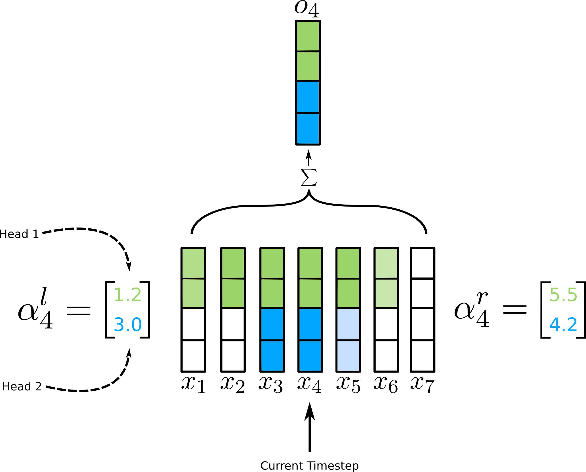

# [Dilated Causal Convolution](https://paperswithcode.com/method/dilated-causal-convolution)

A **Dilated Causal Convolution** is a causal convolution where the filter is applied over an area larger than its length by skipping input values with a certain step. A dilated causal convolution effectively allows the network to have very large receptive fields with just a few layers.

source: [source](http://arxiv.org/abs/1609.03499v2)
# [Causal Convolution](https://paperswithcode.com/method/causal-convolution)

**Causal convolutions** are a type of convolution used for temporal data which ensures the model cannot violate the ordering in which we model the data: the prediction $p(x_{t+1} | x_{1}, \ldots, x_{t})$ emitted by the model at timestep $t$ cannot depend on any of the future timesteps $x_{t+1}, x_{t+2}, \ldots, x_{T}$. For images, the equivalent of a causal convolution is a masked convolution which can be implemented by constructing a mask tensor and doing an element-wise multiplication of this mask with the convolution kernel before applying it. For 1-D data such as audio one can more easily implement this by shifting the output of a normal convolution by a few timesteps.

source: [source](http://arxiv.org/abs/1609.03499v2)
# [Gated Convolution](https://paperswithcode.com/method/gated-convolution)

A **Gated Convolution** is a type of temporal convolution with a gating mechanism. Zero-padding is used to ensure that future context can not be seen.

source: [source](http://arxiv.org/abs/1612.08083v3)
# [TaLK Convolution](https://paperswithcode.com/method/talk-convolutions)

A **Time-aware Large Kernel (TaLK) convolution** is a type of temporal convolution that learns the kernel size of a summation kernel for each time-step instead of learning the kernel weights as in a typical convolution operation. For each time-step, a function is responsible for predicting the appropriate size of neighbor representations to use in the form of left and right offsets relative to the time-step.

source: [source](https://arxiv.org/abs/2002.03184v2)
